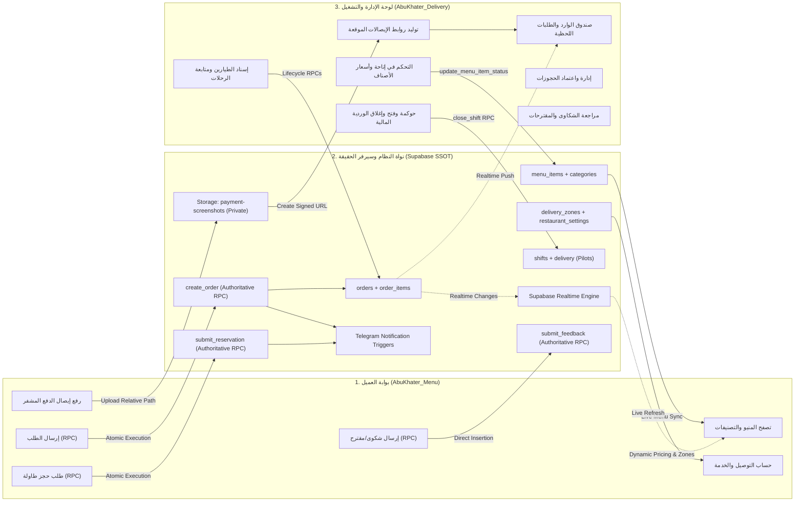

# 🏛️ التحليل المعماري الشامل والمترابط لمنظومة مطاعم أبو خاطر
### Comprehensive System Architecture Audit (Dashboard + Menu + Supabase SSOT)

> **المصدر المعتمد للحقيقة (Single Source of Truth):** قاعدة بيانات Supabase الحية (مشروع `AbuKhater` — `htpnxizfqmnnkhemvmdz` / Postgres 17).
> **المشروعان المفحوصان:**
> 1. `AbuKhater_Delivery` (لوحة تحكم الكاشير، الطيارين، الإدارة، الورديات، والطلبات)
> 2. `AbuKhater_Menu` (تطبيق المنيو، الطلب المباشر، حجز الطاولات، والشكاوى والمقترحات)

---

## 🗺️ خريطة التدفق الموحدة للنظام (End-to-End System Flow)

---

# 📦 الجزء الأول: لوحة تحكم وإدارة المطعم (AbuKhater_Delivery)

### 1.1 بنية النظام والمكونات (Architecture & Responsibilities)
لوحة التحكم تعمل كـ Single Page Application (React 19 + Vite + `@supabase/supabase-js`) موجهة لثلاثة أدوار رئيسية موثقة من السيرفر:
1. **المدير (`admin`):** إدارة كاملة للورديات، الحسابات المالية، التقارير، تسعير التوصيل، وحالات المنيو.
2. **الكاشير (`casher`):** استقبال وتأكيد الطلبات، إنشاء الطلبات اليدوية (`create_manual_order`)، إسناد الطيارين، واعتماد الحجوزات.
3. **الطيار (`driver`):** الاطلاع على الطلبات المسندة، بدء رحلة التوصيل (`start_pilot_trip`)، وتأكيد التسليم (`complete_order_delivery`).

---

### 1.2 تصنيف ملفات ومنطق لوحة التحكم (Dashboard Component & Logic Audit)

| الملف / المسار | التصنيف المعماري | التقييم والسبب الفعلي في الـ Runtime |
|---|---|---|
| `src/App.jsx` | `KEEP — REQUIRED` | المكون الرئيسي لإدارة التنقل والواجهات ومودال إنشاء الطلبات اليدوية والحجوزات. |
| `src/context/AppContext.jsx` | `KEEP — REQUIRED` | عصب الحالة العام (State Management)، يدير مصادقة GoTrue وجلسات `staff_roles` واشتراكات Realtime والطابور الأوفلاين. |
| `src/components/auth/Login.jsx` | `KEEP — REQUIRED` | واجهة تسجيل الدخول المعتمدة على السيرفر ومطابقة كلمات المرور المشفرة للموظفين عبر Supabase Auth. |
| `src/components/orders/OrderInbox.jsx` | `KEEP — REQUIRED` | صلب العمليات اليومية: استقبال الطلبات، التصفية بالوردية، الإسناد، التحديثات اللحظية، والطباعة الحرارية. |
| `src/components/reports/ReportsView.jsx` | `KEEP — REQUIRED` | استعراض تقارير الورديات المقفلة، الإحصائيات المالية المعتمدة، وأداء كل طيار. |
| `src/components/settings/SettingsView.jsx` | `KEEP — REQUIRED` | إدارة إعدادات المطعم (`restaurant_settings`)، مناطق التوصيل (`delivery_zones`)، وإتاحة أصناف المنيو (`MenuAvailabilityManager`). |
| `src/components/feedback/FeedbackView.jsx` | `KEEP — REQUIRED` | استعراض شكاوى ومقترحات العملاء الواردة من تطبيق المنيو. |
| `src/components/common/ConnectionBanner.jsx` | `KEEP — REQUIRED` | شريط حالة الاتصال بالإنترنت ومزامنة طابور العمليات المعلقة. |
| `src/components/common/ReceiptThumbnail.jsx` | `KEEP — REQUIRED` | عارض إيصالات الدفع الآمن والمشفر المعتمد على `createSignedUrl` لمنع تسريب بيانات الدفع. |
| `src/components/layout/Sidebar.jsx` | `KEEP — REQUIRED` | القائمة الجانبية الموجهة بالصلاحيات وحالة اتصال الوردية. |
| `src/services/supabaseService.js` | `KEEP — REQUIRED` | طبقة الوصول الشاملة لبيانات Supabase وجميع دوال الـ RPC وإدارة الأوفلاين. |
| `src/services/storageService.js` | `KEEP — REQUIRED` | خدمة التخزين المشفر، ضغط الصور، وتوليد الروابط الموقعة (Signed URLs). |
| `src/services/printerService.js` | `KEEP — REQUIRED` | خدمة التنسيق والطباعة الحرارية للفواتير وقسائم المطبخ والطيارين. |
| `src/services/supabase/supabaseClient.js` | `KEEP — REQUIRED` | تهيئة عميل Supabase الرسمي. |
| `src/utils/pilotCalculations.js` | `KEEP — REQUIRED` | حساب مستحقات وساعات عمل وحوافز الطيارين. |
| `src/utils/pilotState.js` | `KEEP — REQUIRED` | دوال فحص حالات الطيارين (متاح، في التوصيل، متوقف). |
| `src/utils/safeOrderParser.js` | `KEEP — REQUIRED` | تفكيك وقراءة بنود الطلبات بأمان لمنع أي خطأ Runtime. |
| `src/utils/safeStorage.js` | `KEEP — REQUIRED` | تعامل آمن مع `localStorage` لتفادي أخطاء الحصص والمساحة. |
| `src/utils/shiftGovernance.js` | `KEEP — REQUIRED` | ضوابط مواعيد وأوقات فتح وإغلاق الورديات. |
| `src/utils/shiftLogic.js` | `KEEP — REQUIRED` | منطق التاريخ التشغيلي للوردية وحساب التأخير والدقائق. |
| `src/config/apiConfig.js` | `KEEP — REQUIRED` | إعدادات التنبيهات الصوتية وفترات الاستطلاع الاحتياطي. |
| `src/App.jsx` (ثوابت `AREAS_METADATA` سطر 59-83) | `REVIEW — UNCERTAIN` | مصفوفة مناطق ثابتة مكررة داخل `App.jsx` للطلبات اليدوية؛ الأفضل مستقبلاً قراءتها من `delivery_zones`. |
| `scratch/*.mjs` و`scratch/*.ps1` (37 ملفاً) | `SAFE TO REMOVE — PROVEN UNUSED` | سكريبتات فحص وتدقيق واختبار هجرة قواعد البيانات أثناء مرحلة التطوير. غير مستوردة تماماً في كود الـ Production. |

---

# 📱 الجزء الثاني: خدمات وقائمة العميل (AbuKhater_Menu)

### 2.1 بنية النظام والمكونات (Architecture & Responsibilities)
تطبيق العميل يعمل كـ SPA تفاعلية وسريعة تركز على:
1. **تصفح المنيو المباشر:** جلب الأصناف والتصنيفات ديناميكياً مع استبعاد الأصناف المعطلة أو المخفية وتحديث التوفر لحظياً.
2. **سلة الطلبات والحساب الدقيق:** حساب رسوم التوصيل وفقاً لمناطق `delivery_zones` أو إحداثيات GPS بالمعادلات السيرفرية المعتمدة.
3. **التأكيد والدفع الإلكتروني:** إرسال الطلب عبر `create_order` RPC وتخزين صور التحويل بمسار نسبي محمي في `payment-screenshots`.
4. **حجز الطاولات والشكاوى:** إرسال الحجوزات مع العربون الرسمي وتوثيق الشكاوى عبر دوال RPC السيرفرية.

---

### 2.2 تصنيف ملفات ومنطق تطبيق المنيو (Menu Component & Logic Audit)

| الملف / المسار | التصنيف المعماري | التقييم والسبب الفعلي في الـ Runtime |
|---|---|---|
| `src/App.jsx` | `KEEP — REQUIRED` | موجه المسارات الأربعة الرسمية (`/`, `/review`, `/customer`, `/payment`). |
| `src/pages/MenuPage.jsx` | `KEEP — REQUIRED` | الصفحة الرئيسية للمنيو؛ تعرض الأصناف الحية وحالات التوفر والبحث واشتراك Realtime. |
| `src/pages/ReviewPage.jsx` | `KEEP — REQUIRED` | صفحة مراجعة السلة واختيار نوع الطلب (توصيل / استلام). |
| `src/pages/CustomerPage.jsx` | `KEEP — REQUIRED` | صفحة جمع بيانات العميل ومطابقة الموقع بمناطق `delivery_zones` الحية أو الـ GPS. |
| `src/pages/PaymentPage.jsx` | `KEEP — REQUIRED` | صفحة اختيار طريقة الدفع، عرض أرقام التحويل الحية، ورفع الإيصال واعتماد الطلب. |
| `src/core/context/CartContext.jsx` | `KEEP — REQUIRED` | مزود سلة المشتريات؛ يجلب إعدادات `restaurant_settings` ومناطق `delivery_zones` الحية ويدير الحسابات. |
| `src/core/config/index.js` | `KEEP — REQUIRED` | إعدادات الربط مع Supabase عبر `VITE_SUPABASE_ANON_KEY`. |
| `src/core/constants/index.js` | `KEEP — REQUIRED` | ثوابت الإحداثيات والحدود الاحتياطية المتطابقة مع Supabase. |
| `src/core/utils/calculations.js` | `KEEP — REQUIRED` | دوال حساب مسافات Haversine ورسوم التوصيل والخدمة المتطابقة 100% مع معادلات السيرفر. |
| `src/core/utils/formatters.js` | `KEEP — REQUIRED` | تنسيق العملة والأرقام للعرض باللغة العربية. |
| `src/core/utils/googleDrive.js` | `KEEP — REQUIRED` | تحويل روابط Google Drive إلى روابط صور قابلة للعرض المباشر. |
| `src/core/utils/menuItem.js` | `KEEP — REQUIRED` | دوال التحقق من سلامة بنود المنيو ومعالجة مفاتيح التصنيفات. |
| `src/features/cart/StickyCartBar.jsx` | `KEEP — REQUIRED` | شريط السلة العائم أسفل الشاشة للتنقل السريع لصفحة المراجعة. |
| `src/features/checkout/OrderConfirmation.jsx` | `KEEP — REQUIRED` | مودال تأكيد استلام الطلب برقم الطلب السيرفري المعتمد ووقت التوصيل المتوقع. |
| `src/features/checkout/OrderSummary.jsx` | `KEEP — REQUIRED` | ملخص تفاصيل الأصناف والأسعار في صفحات الدفع والمراجعة. |
| `src/features/checkout/ProgressSteps.jsx` | `KEEP — REQUIRED` | مؤشر خطوات إتمام الطلب (المنيو -> المراجعة -> البيانات -> الدفع). |
| `src/features/feedback/FeedbackModal.jsx` | `KEEP — REQUIRED` | مودال إرسال الشكاوى والمقترحات عبر `submit_feedback` RPC. |
| `src/features/reservation/ReservationModal.jsx` | `KEEP — REQUIRED` | مودال حجز الطاولات المعتمد على حساب العربون الحي من `restaurant_settings` و`submit_reservation` RPC. |
| `src/services/api/index.js` | `KEEP — REQUIRED` | نقطة التصدير الموحدة لجميع خدمات الـ API. |
| `src/services/api/menuService.js` | `KEEP — REQUIRED` | جلب الأصناف والتصنيفات من Supabase مباشرة بدون Fallback. |
| `src/services/api/orderService.js` | `KEEP — REQUIRED` | إرسال الطلبات عبر `create_order` RPC وتتبع حالة الطلبات. |
| `src/services/api/reservationService.js` | `KEEP — REQUIRED` | إرسال الحجوزات ورفع الإيصالات للمسار المحمي. |
| `src/services/api/settingsService.js` | `KEEP — REQUIRED` | جلب إعدادات المطعم ومناطق التوصيل اللحظية من Supabase. |
| `src/services/api/feedbackService.js` | `KEEP — REQUIRED` | إرسال الشكاوى لقاعدة البيانات. |
| `src/services/supabase/supabaseClient.js` | `KEEP — REQUIRED` | تهيئة عميل Supabase. |
| `src/hooks/useCart.js` | `KEEP — REQUIRED` | Hook للوصول لبيانات السلة والإعدادات. |
| `src/hooks/useLocalStorage.js` | `KEEP — REQUIRED` | حفظ سلة العميل والعملاء المسجلين محلياً. |
| `src/components/common/LoadingSpinner.jsx` | `KEEP — REQUIRED` | مؤشر التحميل المشترك. |
| `src/core/utils/data.js` | `SAFE TO REMOVE — PROVEN UNUSED` | تم تفريغه بالكامل؛ لم يعد مستخدماً في أي مكان بعد ربط المنيو بـ Supabase. |
| `src/core/utils/orderId.js` | `SAFE TO REMOVE — PROVEN UNUSED` | دالة قديمة لتوليد معرّفات الطلبات من الفرونت إند؛ تم استبدالها برقم الطلب السيرفري المعتمد من `order_number_seq`. |
| `src/core/utils/errors.js` | `SAFE TO REMOVE — PROVEN UNUSED` | دالة `describeFetchError` غير مستوردة في أي ملف في المشروع. |
| `src/features/cart/CartDrawer.jsx` | `SAFE TO REMOVE — PROVEN UNUSED` | دراور السلة القديم المدمج (474 سطر) تم استبداله بالكامل بصفحات المسار `/review` و`/customer` و`/payment`. |
| `src/features/checkout/CountdownTimer.jsx` | `SAFE TO REMOVE — PROVEN UNUSED` | عداد قديم غير مستخدم في صفحات الدفع الحالية. |
| `src/features/menu/MenuCard.jsx` | `SAFE TO REMOVE — PROVEN UNUSED` | كارت منيو قديم غير مستخدم؛ `MenuPage.jsx` يحتوي على `MenuProductCard` المخصص. |
| `src/assets/banner2.png` | `SAFE TO REMOVE — PROVEN UNUSED` | صورة بانر قديمة بديلة غير مستخدمة (`banner.png` هي المستخدمة). |
| `src/assets/react.svg` | `SAFE TO REMOVE — PROVEN UNUSED` | أيقونة القالب الافتراضي لـ Vite. |

---

## 🔒 ملخص الضوابط الأمنية وحوكمة البيانات (Security & SSOT Governance)

1. **السرية والـ PII (Storage Bucket):**
   * الـ Bucket المسماة `payment-screenshots` مغلقة بالكامل (`public: false`).
   * الـ Menu يرفع الصورة عبر صلاحية `INSERT` العامة ويخزن مسارها فقط (`payments/...` أو `reservations/...`).
   * الـ Dashboard هو الوحيد القادر على عرض الصور عبر توليد `Signed URLs` للمستخدم الموثق كـ (`admin`/`casher`/`driver`).
2. **الحسابات المالية والسعرية (Authoritative Totals):**
   * العميل في المنيو يعرض الأسعار والرسوم كمعاينة دقيقة، لكن الحساب الإلزامي النهائي يتم داخل دالة `create_order` على السيرفر، مما يمنع التلاعب بالأسعار من المتصفح.
3. **عوائق الورديات (Shift Integrity):**
   * محاولة إنشاء طلب أو فتح وردية خارج مواعيد العمل أو بدون وردية مفتوحة يتم رفضها مباشرة بكود الخطأ السيرفري `P0001` دون المساس بسلامة البيانات.
