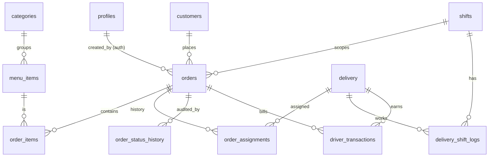

# Abu Khater Delivery — Supabase Architecture Audit & Technical Improvement Plan

> Senior Supabase architecture review of the `delivery-system` app (React 19 + Vite + `@supabase/supabase-js`).
> Findings combine a full source-code read with a **live inspection of the production project** `AbuKhater` (`htpnxizfqmnnkhemvmdz`, Postgres 17) via the Supabase management API: real columns, foreign keys, RLS policies, functions/triggers, storage buckets, and the official Security/Performance advisors.

---

## 1. Executive Summary

The application works as a single-page operations console (orders, drivers/"pilots", shifts, reservations, feedback) backed by Supabase (Postgres + Realtime + Storage + Edge Function). The code is feature-rich and the offline handling is thoughtful, but the **data layer is in a fragile and insecure state**:

- **Authentication does not exist.** Login is a hard-coded client-side PIN (`8080` / `123`) in `localStorage`. There is no Supabase Auth session, so `auth.uid()` is always `NULL`.
- **RLS is effectively disabled by policy.** Every table is reachable with the public **anon key** (which is committed in `.env` and shipped in the browser bundle) for `SELECT/INSERT/UPDATE`, all with `USING (true)` / `WITH CHECK (true)`. Anyone on the internet can read customer PII (names, phones, addresses, payment screenshots) and driver national IDs, and can mutate orders/shifts/drivers.
- **The schema is split-brained.** A well-designed normalized schema exists in the DB (`customers`, `order_items`, `order_status_history`, `order_assignments`, `driver_transactions`, `order_events`, `notifications`, `sync_queue`, `profiles`) but the **app ignores almost all of it**, instead denormalizing everything onto `orders` (`raw_payload` JSON for items, `pilot_id`/`pilot_name` text columns) and never writing the relational tables (they are all 0 rows).
- **A referenced table does not exist.** The app reads/writes `menu_availability`, which is **not in the database** — the menu availability feature fails silently.
- **Status values are an un-validated free-text mix** of Arabic and English with no `enum`/`CHECK`, and three different vocabularies across the frontend, the `close_shift` RPC, and the `assign_order_to_pilot` RPC.
- **Type mismatches** between `orders.pilot_id`/`shift_id` (`text`) and `delivery.id` (`bigint`)/`shifts.id` (`text`), with a redundant `delivery_id bigint` FK that is the *real* relation.
- **Dead/broken server-side RPCs** (`start_driver_shift`, `end_driver_shift`) target a non-existent `drivers` table; `assign_order_to_pilot` is unused and emits a status (`assigned`) no other layer understands.

Nothing here blocks the happy path today, but the system is one curious visitor away from a data breach, and several latent bugs will surface as volume grows.

**Priority order:** (P0) Auth + RLS + secret hygiene → (P1) data-model consistency (items, status enum, FK types, `menu_availability`, `close_shift` over-association) → (P2) consolidate to server-side transactional RPCs & migrations → (P3) realtime/perf/cleanup.

---

## 2. System Overview

| Layer | Technology | Notes |
|---|---|---|
| Frontend | React 19, Vite 7, framer-motion, lucide | SPA, RTL Arabic UI |
| State | React Context (`src/context/AppContext.jsx`) | Single global provider, ~1280 lines |
| Data access | `src/services/supabaseService.js` | All Supabase reads/writes + offline queue |
| Client | `@supabase/supabase-js` v2 (anon key) | `src/services/supabase/supabaseClient.js` |
| Storage | bucket `payment-screenshots` (public) | `src/services/storageService.js` |
| Edge Function | `telegram-order-alert` | Boilerplate only (returns "Hello") |
| Server logic | Postgres RPCs + triggers | `open_shift`, `close_shift`, telegram triggers, etc. |
| Auth | **None** (client-side PIN) | `src/components/auth/Login.jsx` |

---

## 3. Database Schema (as it actually exists in production)

19 tables exist; the frontend only touches 7 of them. Row counts show how much of the design is unused.

| Table | RLS | Rows | Used by app? | Purpose |
|---|---|---|---|---|
| `orders` | on | 2 | ✅ heavily | Order records (denormalized) |
| `order_items` | on | **0** | ⚠️ read-only join, never written | Line items (intended normalized) |
| `delivery` | on | 2 | ✅ | Drivers ("pilots"); comment `deliveryManger` |
| `shifts` | on | 0 | ✅ | Operational shifts |
| `reservations` | on | 3 | ✅ | Table reservations |
| `feedback` | on | 1 | ✅ | Customer feedback |
| `app_config` | on | 2 | ✅ | Shift-window settings (key/value) |
| `menu_items` | on | 174 | partial | Menu (joined via `order_items.item_id`) |
| `categories` | on | 11 | ❌ | Menu categories |
| `restaurant_settings` | on | 4 | ❌ | Settings (key/value, unused by app) |
| `customers` | on | 0 | ❌ | Normalized customer master (unused) |
| `profiles` | on | 0 | ❌ | `auth_user_id`, `role`, `is_active` — intended RBAC, unused |
| `order_status_history` | on | 0 | ❌ | Status audit trail (unused) |
| `order_assignments` | on | 0 | ❌ | Driver assignment history (unused) |
| `order_events` | on | 0 | ❌ | Event log (unused) |
| `driver_transactions` | on | 0 | ❌ | Driver financials (unused) |
| `delivery_shift_logs` | on | 0 | ❌ (referenced in `close_shift`) | Per-driver shift logs |
| `notifications` | on | 0 | ❌ | Notifications (unused) |
| `sync_queue` | on | 0 | ❌ | Server-side offline queue (unused; app uses `localStorage`) |

### 3.1 `orders` (authoritative columns)

`id uuid PK default gen_random_uuid()`, `order_number bigint NOT NULL default nextval(...)`, `customer_name text`, `customer_phone text`, `customer_phone_2 text`, `order_type text`, `total_amount numeric`, `delivery_fee numeric`, `service_fee numeric`, `paid_now numeric`, `remaining_amount numeric`, `status text`, `delivery_address text`, `payment_method text`, `payment_screenshot text`, `latitude numeric`, `longitude numeric`, `raw_payload jsonb`, `source text`, `original_id text`, **`pilot_id text`**, `pilot_name text`, **`delivery_id bigint` → delivery.id**, **`shift_id text` → shifts.id**, `delivery_shift_log_id bigint → delivery_shift_logs.id`, `telegram_sent bool`, `cancel_telegram_sent bool`, `created_at timestamptz`.

4 triggers fire on `orders`: `trigger_assign_shift_to_order`, `trigger_order_insert_telegram`, `trigger_order_update_telegram`, `trigger_sync_delivery_shift`.

### 3.2 `delivery` (drivers)

`id bigint PK`, `name`, `phone`, `number_motor text`, `number_id bigint` (national ID — PII), `start_shift time`, `end_shift time`, `id_delivery smallint`, `shift_started_at timestamptz`, `shift_ended_at timestamptz`, `state text`, `last_return_time timestamptz`, `total_minutes int`, `orders_count int`, `shift_used bool`, `created_at`.

### 3.3 `shifts`

`id text PK`, `date date`, `start_time timestamptz`, `end_time timestamptz`, `status text`, `total_orders int`, `stats jsonb`, `created_at`. **Note `id` is `text`, but `open_shift(p_id uuid, ...)` is declared with a `uuid` parameter** (relies on implicit cast).

---

## 4. Foreign Keys & Relationships

Real FKs in the DB (most reference tables the app never populates):

```
order_items.order_id        -> orders.id
order_items.item_id         -> menu_items.id        (added by alter_order_items.sql)
orders.delivery_id          -> delivery.id          (bigint)  ← the real driver link
orders.shift_id             -> shifts.id            (text)
orders.delivery_shift_log_id-> delivery_shift_logs.id
menu_items.category_id      -> categories.id
order_assignments.order_id  -> orders.id
order_assignments.delivery_id -> delivery.id
order_status_history.order_id -> orders.id
order_events.order_id       -> orders.id
driver_transactions.delivery_id -> delivery.id
driver_transactions.order_id    -> orders.id
driver_transactions.shift_id    -> shifts.id
delivery_shift_logs.delivery_id -> delivery.id
delivery_shift_logs.shift_id    -> shifts.id
```

**Missing / broken relations:**

- **`orders.pilot_id` (text) has no FK** and duplicates `orders.delivery_id` (bigint, the real FK). The app writes both (`updateOrderStatus` sets `pilot_id = String(...)` and `delivery_id = number`). This is a denormalization/consistency trap: the two can disagree, and `pilot_name` can go stale if a driver is renamed.
- **`orders` ↔ `customers`**: no relationship. Customer identity is copied as free text into every order plus `raw_payload`. No dedup, no customer history.
- **`order_items` is never written by the app** (0 rows). Items live only in `orders.raw_payload` JSON. The `item_id → menu_items` FK therefore protects nothing, and you cannot do relational sales/menu analytics.

---

## 5. RLS & Authentication

### 5.1 Authentication — **none**

```40:62:src/components/auth/Login.jsx
    const storageKey = `b_delivery_password_${selectedUser}`;
    const correctPassword = safeGetItem(storageKey) || '8080';
    if (pin === correctPassword) {
      sessionStorage.setItem('b_delivery_session_user', selectedUser);
      setUserRole(selectedUser);
```

- The "role" (`admin`/`casher`/`driver`) lives only in `sessionStorage` and React state. It is trivially set from the browser console.
- Default PINs `8080` (admin/casher) and `123` (pilot shift toggle) are hard-coded in source (`AppContext.jsx`, `App.jsx`, `OrderInbox`/`PilotManagement`).
- There is **no Supabase Auth** anywhere. The intended RBAC table `public.profiles` (`auth_user_id`, `role`, `is_active`) is empty and unwired.

### 5.2 RLS — enabled but wide open

RLS is *enabled* on every table, which gives a false sense of security. The actual policies (and the official advisor) tell the real story:

- **`rls_policy_always_true` (WARN ×many)** — `orders`, `reservations`, `delivery`, `categories`, `menu_items`, `shifts`, `feedback` all have `INSERT`/`UPDATE` (and `feedback` `DELETE`) policies that are `WITH CHECK (true)` / `USING (true)` for the `public`/`anon` role. **The anon key can read and write everything.**
- **`rls_enabled_no_policy` (INFO ×13)** — `app_config`, `order_items`, `order_status_history`, `order_assignments`, `order_events`, `driver_transactions`, `delivery_shift_logs`, `notifications`, `sync_queue`, `customers`, `profiles`, `restaurant_settings` have RLS on but **no policies at all**. For `app_config` this means the anon client's reads/writes only succeed because the calls are funneled through `SECURITY DEFINER` paths or are being silently swallowed by the offline wrapper — but `fetchAppConfig`/`updateAppConfig` do direct table access and will be **blocked**, so the live shift-window settings sync is effectively non-functional via the table (it works only from cached defaults). This needs verification and explicit policies.
- **Duplicate/overlapping policies** — e.g. `orders` has 2 INSERT policies, `reservations` has 3 INSERT + duplicates, `categories`/`menu_items` have 5 each. This is confusing and (per the performance advisor pattern) multiple permissive policies are evaluated per query.
- **Storage**: bucket `payment-screenshots` is **public with a broad `SELECT` listing policy** (`public_bucket_allows_listing` WARN) — clients can enumerate *all* uploaded payment receipts (financial PII).

### 5.3 Dangerous functions exposed to anon

- **`send_telegram_message(message, photo_url)` is `SECURITY DEFINER` and callable by `anon`** via `/rest/v1/rpc/send_telegram_message`. Anyone can send arbitrary messages/photos through your Telegram bot (spam/abuse, possible token exfil vector).
- **`rls_auto_enable()`** (`SECURITY DEFINER`) is also anon-executable as an RPC.
- **12 functions have a mutable `search_path`** (`function_search_path_mutable` WARN) — `assign_order_to_pilot`, `calculate_shift_minutes`, telegram functions, `update_updated_at_column`, etc. — a privilege-escalation hardening gap for `SECURITY DEFINER` code.
- **`http` extension is installed in `public`** (`extension_in_public` WARN).

### 5.4 Secret hygiene

- `.env` is **committed to git** and tracked (verified via `git ls-files`). It contains the anon key for both `REACT_APP_*` and `VITE_*`. The anon key is *meant* to be public, but committing `.env` is a bad pattern and will eventually leak a `service_role` key the same way.

---

## 6. Realtime Usage

Subscriptions are created in `AppContext` for `orders`, `delivery`, `reservations`, and `app_config`:

```789:820:src/services/supabaseService.js
  subscribeToOrders(callback) {
    const channelId = `orders-realtime-${Date.now()}`;
    return supabase
      .channel(channelId)
      .on('postgres_changes', { event: '*', schema: 'public', table: 'orders' }, payload => {
        callback(payload);
      })
      .subscribe();
  },
```

Issues:

- **Refetch-on-every-event.** Each realtime event triggers a *full* `fetchOrders` re-pull rather than applying the `payload` delta:

```304:306:src/context/AppContext.jsx
    ordersSub = supabaseService.subscribeToOrders(() => {
      fetchInitialData(); // Re-fetch all data gently on change
    });
```

  Combined with a 30s fallback poll, this is O(events × full-table) traffic. Fine at 2 rows, costly at scale.
- **Realtime publication coverage is unverified.** `app_config` is added to `supabase_realtime` in `shift_governance.sql`, but `orders`/`delivery`/`reservations` rely on the publication already including them. If not, the UI silently falls back to polling.
- **Channel name churn** (`Date.now()` suffix) means reconnects create brand-new channels; old channels are only cleaned up via the effect cleanup, which is correct here, but the pattern is brittle.
- Realtime broadcasts row changes to **anonymous** subscribers — given the open RLS, anyone can subscribe to the live order/customer feed.

---

## 7. Order Lifecycle

Status is **free text** with no `CHECK`/`enum`, written in **mixed Arabic/English**, and translated in three different places.

Frontend internal states: `pending_timer → pending → waiting_driver → driver_assigned → active → completed`/`delivered` (plus `cancelled`, `failed_delivery`).

DB persisted strings (`updateOrderStatus`): `في التحضير`, `تم الإسناد للطيار`, `في الطريق للتسليم`, `تم التوصيل`, `ملغي (...)`, `فشل التوصيل (...)`.

```378:384:src/services/supabaseService.js
      let dbStatus = newStatus;
      if (newStatus === 'confirmed' || newStatus === 'waiting_driver') dbStatus = 'في التحضير';
      else if (newStatus === 'cancelled') dbStatus = reason ? `ملغي (${reason})` : 'ملغي';
      else if (newStatus === 'driver_assigned') dbStatus = 'تم الإسناد للطيار';
      else if (newStatus === 'out_for_delivery' || newStatus === 'active') dbStatus = 'في الطريق للتسليم';
      else if (newStatus === 'completed' || newStatus === 'delivered') dbStatus = 'تم التوصيل';
```

Problems:

- **Reason embedded in status** (`ملغي (سبب)`) makes status unqueryable and unbounded — cancellation/failure reasons belong in their own column.
- **`assign_order_to_pilot` RPC writes `status = 'assigned'`**, which is in *none* of the frontend map nor the `close_shift` active-orders list — an order assigned that way would be invisible to the UI and wrongly allow shift closing.
- **No DB-side state machine.** Any value can be written; nothing prevents `delivered → pending` regressions.
- **`close_shift` over-associates orders:**

```227:229:supabase/shift_governance.sql
  UPDATE public.orders
  SET shift_id = p_shift_id
  WHERE shift_id IS NULL;
```

  This grabs **every** order with a `NULL` `shift_id` in the whole table (including orphans from other days) and attaches them to the shift being closed — a real data-integrity bug. The `trigger_assign_shift_to_order` already sets `shift_id` on insert, so this blanket update should be removed or scoped to `created_at`/time window.
- **Optimistic local state + refetch merge** is intricate (`LOCAL_ONLY_FIELDS`, `pendingUpdatesRef`, `localIsNewer`) and is the kind of code that produces "status flip-flop" bugs under concurrent edits.

---

## 8. Driver Assignment Flow

Implemented **entirely client-side** in `assignPilot` (`AppContext.jsx`): it validates the pilot is `available`, optimistically flips order → `driver_assigned` and pilot → `busy`, then fires two independent network calls (`updateOrderStatus` + `updatePilotState`).

```793:835:src/context/AppContext.jsx
  const assignPilot = (orderId, pilotId) => {
    ...
    if (pilot.state !== 'available') { ...alert... return; }
    ...
    setPilots(prev => prev.map(p => String(p.id) === String(pilotId) ? { ...p, state: 'busy' } : p));
    supabaseService.updatePilotState(pilotId, { state: 'busy' });
  };
```

Problems:

- **No atomicity / race condition.** Two cashiers can assign the same `available` driver to two orders simultaneously; the check is client-side only. The order update and the driver-state update are separate requests — one can succeed while the other fails, leaving an order `driver_assigned` to a driver still `available` (or vice-versa).
- **A correct server RPC exists but is unused.** `assign_order_to_pilot(p_order_id, p_pilot_id bigint, p_pilot_name)` does the busy-check + both updates in one transaction — exactly what's needed — but the app never calls it (and it writes the orphan status `assigned`).
- **`start_driver_shift(uuid)` / `end_driver_shift(uuid)` are dead and broken**: they `UPDATE drivers ...` but there is **no `drivers` table** (it's `delivery`), and they take a `uuid` while `delivery.id` is `bigint`. They would error if ever called.
- **`orders.pilot_id` is `text`** while assignment naturally keys on `delivery.id bigint`; the app stores both, inviting drift.
- **`ordersCount` is computed three different ways** (live effect, `failDelivery`, `completeOrder`, `activeStats`) which can disagree.

---

## 9. Offline Sync Strategy

A `localStorage`-backed queue in `supabaseService.js` retries failed mutations on `window 'online'`:

```39:81:src/services/supabaseService.js
export const processPendingSync = async () => {
  if (!navigator.onLine) return;
  const q = getPendingQueue();
  ...
  for (const item of q) { try { /* replay by action name */ } catch { remainingQueue.push(item); } }
  savePendingQueue(remainingQueue);
};
```

Strengths: thoughtful per-action replay, validation errors (`P0001`) are not re-queued, optimistic UI.

Weaknesses / bugs:

- **A server-side `sync_queue` table exists but is unused** — the design intended durable, cross-device sync; the implementation is per-browser `localStorage` only. Queue is lost if the browser cache is cleared and never shared across devices.
- **Reads return `[]`/`null` on failure silently** (`withOfflineSupport(..., null)`), so the UI can't always distinguish "offline" from "empty".
- **No idempotency keys.** Replayed `createManualOrder`/`createReservation` can create duplicates if a request actually succeeded but the response was lost (the classic at-least-once delivery problem). The `id`/`originalId` dedup is client-side only.
- **FK risk for offline-created shifts:** an order inserted offline carries `shift_id` of a shift that may not yet exist in the DB → `orders.shift_id → shifts.id` FK violation on replay (non-requeued as a hard error path depends on the code path).
- **`menu_availability` writes are queued forever** because the target table doesn't exist (every attempt errors and re-queues).
- Client clock is used for timestamps (`getSafeISOTime`), so offline events get device-time, not server-time, skewing shift-minute math.

---

## 10. Consolidated Findings

Severity: **P0 critical**, **P1 high**, **P2 medium**, **P3 low**.

### Bugs

| # | Sev | Finding | Evidence |
|---|---|---|---|
| B1 | P1 | `menu_availability` table referenced by app **does not exist** → menu availability silently broken & queues forever | `supabaseService.fetchMenuAvailability/updateMenuAvailability`; `to_regclass('public.menu_availability')` = `NULL` |
| B2 | P1 | `close_shift` associates **all** orphan (`shift_id IS NULL`) orders to the closing shift | `shift_governance.sql` step 3 |
| B3 | P1 | `start_driver_shift`/`end_driver_shift` reference non-existent `drivers` table and wrong id type (`uuid` vs `bigint`) | function defs |
| B4 | P2 | `assign_order_to_pilot` sets `status='assigned'`, unknown to UI mapping and to `close_shift` active list | function def vs `supabaseService` map |
| B5 | P2 | `app_config` has RLS on but **no policy** → direct `fetch/updateAppConfig` blocked; live shift-window sync degraded | advisor `rls_enabled_no_policy` |
| B6 | P2 | `generateUUID()` uses `Math.random()` (not crypto) → collision/predictability risk for local ids | `shiftLogic.js` |
| B7 | P3 | Reservation default deposit inconsistent (`50` in DB insert, `105`/`50` in UI) | `createReservation` vs `AppContext.addReservation` |
| B8 | P3 | Realtime refetches entire dataset per event + 30s poll | `AppContext` effect |

### Missing relations / data model

| # | Sev | Finding |
|---|---|---|
| M1 | P1 | `order_items` never written; line items live only in `orders.raw_payload` JSON → no relational integrity or analytics |
| M2 | P1 | `orders.pilot_id text` has no FK and duplicates `orders.delivery_id bigint` (the real FK); `pilot_name` denormalized/stale-prone |
| M3 | P2 | `orders` ↔ `customers` has no relationship; customer data copied per order, no dedup/history |
| M4 | P2 | Entire normalized/event design unused: `order_status_history`, `order_assignments`, `order_events`, `driver_transactions`, `notifications`, `sync_queue` (all 0 rows) |
| M5 | P2 | `shifts.id` is `text` but RPC params/`open_shift` use `uuid` (implicit cast); inconsistent key typing |
| M6 | P3 | No version-controlled migrations: only 3 ad-hoc `.sql` files; live schema drifted far beyond them |

### Security

| # | Sev | Finding |
|---|---|---|
| S1 | P0 | **No authentication**; client-side PIN (`8080`/`123`) hard-coded; roles set in `sessionStorage` |
| S2 | P0 | **RLS open to anon** for read+write on all business tables (`USING/WITH CHECK (true)`) → full data exposure & tampering with the public key |
| S3 | P0 | Customer PII + driver national IDs + payment screenshots readable by anyone; `payment-screenshots` bucket is public & **listable** |
| S4 | P1 | `send_telegram_message` (`SECURITY DEFINER`) callable by `anon` → bot abuse/spam |
| S5 | P1 | `rls_auto_enable` `SECURITY DEFINER` exposed to anon RPC |
| S6 | P1 | 12 functions with **mutable `search_path`**; `http` extension in `public` schema |
| S7 | P2 | `.env` committed to git |
| S8 | P2 | Tables with RLS enabled but no policy (13) — inconsistent posture, future foot-guns |

### Data consistency

| # | Sev | Finding |
|---|---|---|
| C1 | P1 | Order `status` is free text, no enum/CHECK, mixed Arabic/English across 3 vocabularies; reasons embedded in status string |
| C2 | P1 | Client-side, non-atomic driver assignment → double-booking & order/driver state divergence (a transactional RPC exists but is unused) |
| C3 | P2 | `ordersCount`/`total_minutes` computed in multiple places with divergent rules; client-clock timestamps |
| C4 | P2 | At-least-once offline replay without idempotency keys → possible duplicate orders/reservations |
| C5 | P3 | Two parallel server logic sets (Arabic table-update path vs English RPC path) drift apart |

---

## 11. Technical Improvement Plan

### Phase 0 — Lock down access (P0, security-critical)

1. **Introduce Supabase Auth.** Replace the client PIN with real accounts (email/password or phone OTP). Wire `public.profiles(auth_user_id, role, is_active)` to `auth.users` via a trigger on signup. Drive UI roles from `profiles.role`, not `sessionStorage`.
2. **Rewrite RLS around `auth.uid()` and a role helper.** Replace all `USING (true)` write policies with role-scoped policies, e.g.:
   - A `SECURITY DEFINER` `public.current_role()` returning `profiles.role` for `auth.uid()` (with a fixed `search_path`).
   - `orders`/`reservations`/`delivery`/`shifts`: `SELECT`/`INSERT`/`UPDATE` restricted to authenticated staff; drivers limited to their own assigned orders.
   - Remove duplicate/overlapping policies; one policy per (table, command, role).
3. **Storage:** make `payment-screenshots` private; serve via signed URLs; remove the broad listing `SELECT` policy.
4. **Functions:** revoke `EXECUTE` from `anon`/`authenticated` on `send_telegram_message` and `rls_auto_enable` (or make them `SECURITY INVOKER`); set `search_path = ''` (schema-qualified) on all `SECURITY DEFINER` functions; move the `http` extension out of `public`.
5. **Secrets:** `git rm --cached .env`, add to `.gitignore`, rotate keys; keep only `VITE_*` names. Plan for the `service_role` key to live only in Edge Functions/secrets.
6. Add explicit policies for the 13 RLS-on/no-policy tables (default deny + scoped allow).

### Phase 1 — Fix data-model bugs (P1)

1. **`menu_availability`:** either create the table (`item_name text PK unique, is_available bool, updated_at timestamptz`) with RLS, **or** repoint the feature to a boolean column on `menu_items` and delete the dead service code. Drain the poisoned offline queue.
2. **`close_shift`:** remove the blanket `UPDATE orders SET shift_id = p_shift_id WHERE shift_id IS NULL`; rely on `trigger_assign_shift_to_order`, or scope to `created_at` within the shift window.
3. **Status enum:** introduce a canonical `order_status` enum (or `CHECK` + lookup table), migrate existing Arabic strings, move cancellation/failure reason to `orders.cancel_reason`/`fail_reason` columns, and centralize display translation in one frontend map.
4. **Driver link:** make `orders.delivery_id bigint` the single source of truth; drop `pilot_id text` (or keep as a generated mirror); resolve `pilot_name` via join, not storage.
5. **Driver assignment:** switch `assignPilot` to a transactional RPC (`assign_order_to_pilot`, corrected to emit the canonical status and to check availability atomically), eliminating the double-booking race.
6. **Remove/repair dead RPCs:** delete or rewrite `start_driver_shift`/`end_driver_shift` to target `delivery` with `bigint` ids (the app already toggles shifts via `updatePilotState`).

### Phase 2 — Consolidate to a coherent server-side model (P1/P2)

1. **Adopt version-controlled migrations** under `supabase/migrations/` (use the Supabase CLI). Snapshot current prod schema as the baseline, then apply all changes as migrations. Retire the ad-hoc `.sql` files.
2. **Persist line items relationally:** write `order_items` on order creation (the join already reads them), keep `raw_payload` only as an audit blob.
3. **Use the normalized tables that already exist:** write `order_status_history` (via trigger), `order_assignments`, and `driver_transactions` for financials, instead of recomputing earnings on the client at shift close.
4. **Server-authoritative shift math:** compute `total_minutes`/earnings in Postgres (`calculate_shift_minutes` already exists) using `now()`, not device time.

### Phase 3 — Realtime, sync & performance (P2/P3)

1. **Apply realtime deltas** from the `payload` instead of full refetch; verify `supabase_realtime` publication includes `orders`/`delivery`/`reservations`; keep a longer (e.g. 60s) safety poll.
2. **Idempotency for offline replay:** attach a client-generated UUID idempotency key per mutation; enforce uniqueness server-side; consider migrating the queue onto the existing `sync_queue` table for cross-device durability.
3. **Indexes:** add indexes for hot filters — `orders(shift_id)`, `orders(status)`, `orders(created_at desc)`, `orders(delivery_id)` — and run the **performance advisor** after RLS rewrite (RLS predicates frequently need supporting indexes; wrap `auth.uid()` calls in `(select auth.uid())` to avoid per-row re-evaluation).
4. **Cleanup:** drop genuinely unused tables/functions or document them; collapse duplicate policies; finish or remove the boilerplate `telegram-order-alert` Edge Function.

### Suggested target relationships (ERD)



---

## 12. Appendix — Advisor Summary (live)

**Security advisor:** 13× `rls_enabled_no_policy` (INFO), 12× `function_search_path_mutable` (WARN), 1× `extension_in_public: http` (WARN), ~25× `rls_policy_always_true` (WARN) across `orders/reservations/delivery/categories/menu_items/shifts/feedback`, 1× `public_bucket_allows_listing: payment-screenshots` (WARN), 2× `anon_security_definer_function_executable` (`rls_auto_enable`, `send_telegram_message`), 2× `authenticated_security_definer_function_executable` (same).

Re-run `get_advisors(security)` and `get_advisors(performance)` after each phase to track remediation.

---

*Prepared from a full read of `src/**` and `supabase/**` plus live inspection of project `htpnxizfqmnnkhemvmdz`. No schema or data was modified during this audit (read-only queries only).*
