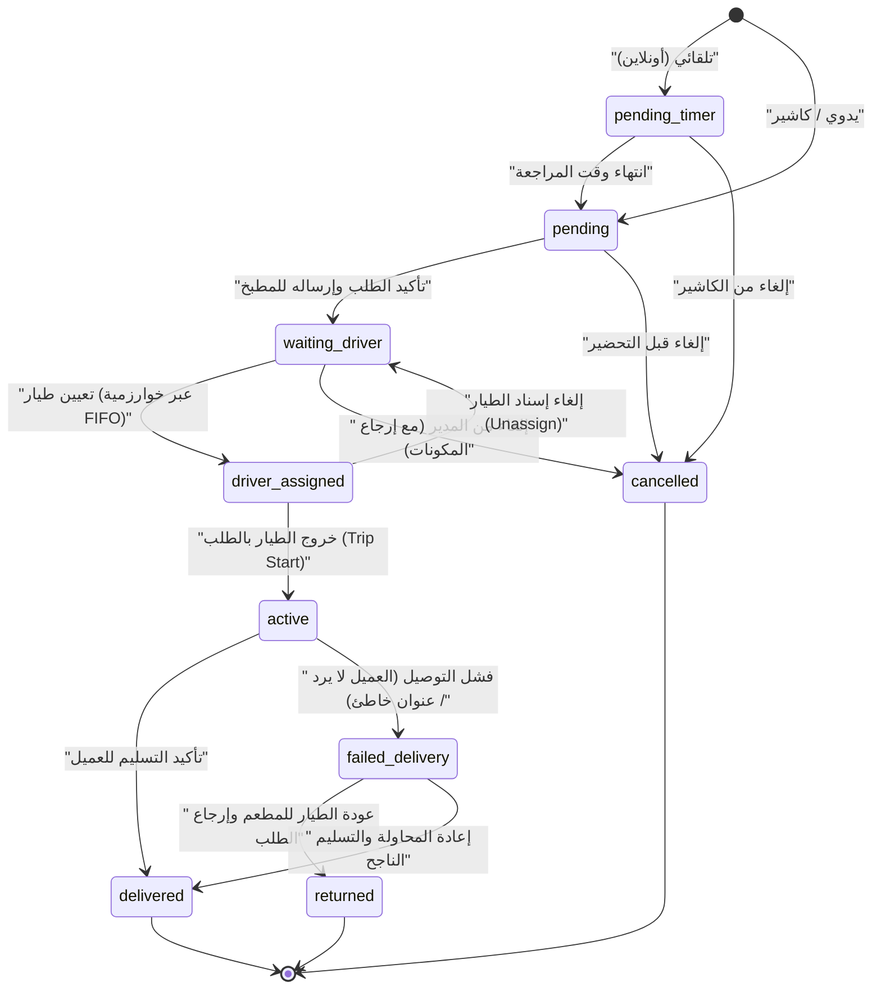
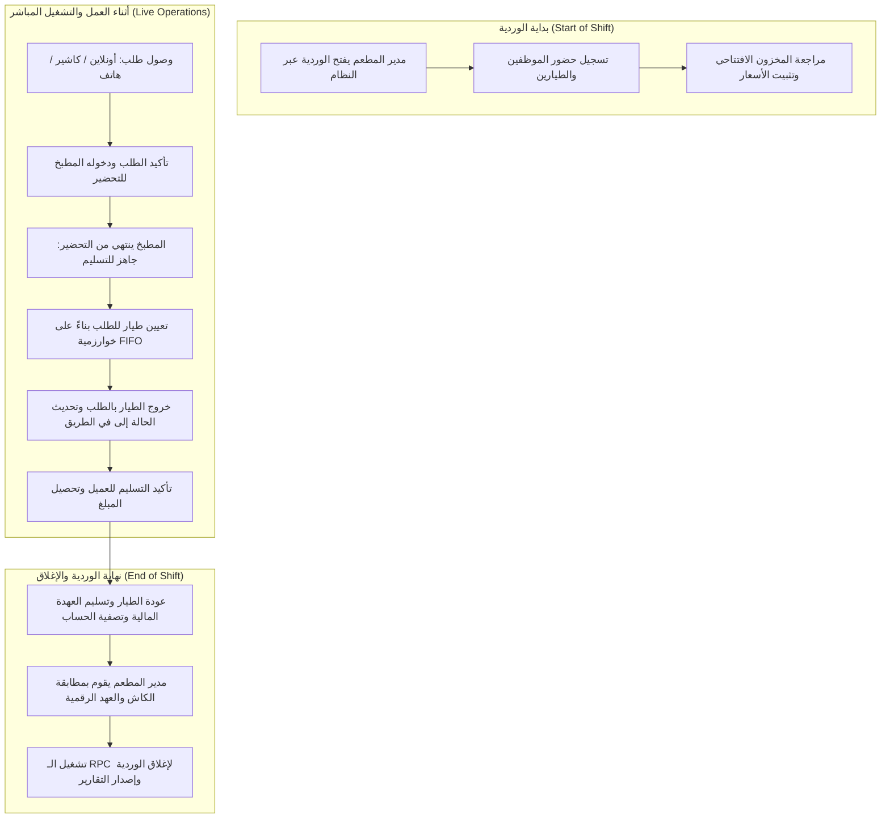
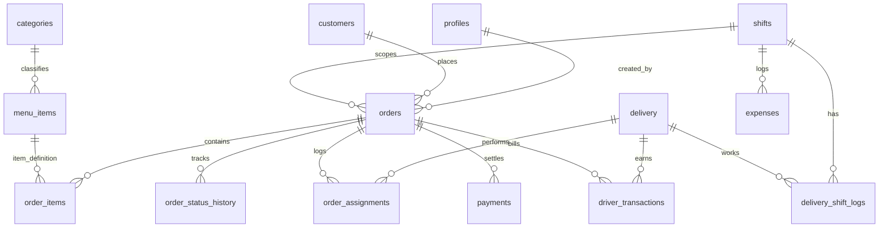
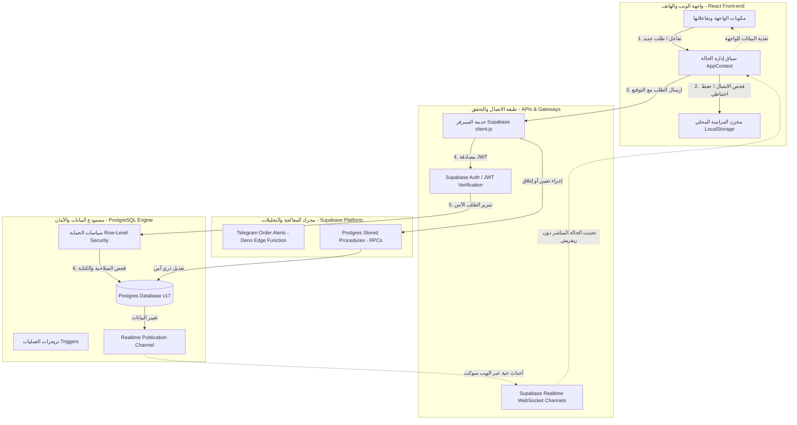

# وثيقة التصميم الهندسي وهيكلية النظام (System Design & Architecture Document)
## نظام إدارة الطلبات والتوصيل لمطعم أبو خاطر (Abu Khater Delivery System)

تعد هذه الوثيقة المرجع الهندسي الشامل والجاهز للتنفيذ لفريق التطوير لبناء نظام مستقر يعمل على مدار 24 ساعة (مع وردية تشغيل طويلة تصل إلى 20 ساعة متواصلة)، مع ضمان الأمان العالي، تكامل البيانات، والقدرة على العمل في ظروف انقطاع الإنترنت (Offline-first) باستخدام تقنيات Supabase وPostgreSQL في الخلفية وReact في الواجهة الأمامية.

---

## 1. وصف النظام العام (General System Description)

النظام مصمم لخدمة مطعم أبو خاطر الذي يواجه ضغط تشغيل عالٍ ووردية عمل يومية طويلة تمتد من الصباح الباكر حتى الساعات الأولى من اليوم التالي.

### فكرة النظام العامة
يعمل النظام كمنصة موحدة لاستقبال ومعالجة وتوصيل الطلبات من مصادر مختلفة:
1. **طلبات عبر الإنترنت (Online Orders):** تصل تلقائياً عبر موقع المطعم أو تطبيقات التوصيل الخارجية (مثل Talabat).
2. **طلبات يدوية داخلية (Offline/Manual Orders):** يتم إدخالها مباشرة عبر الكاشير في نقطة البيع (POS).
3. **طلبات الهاتف والواتساب (Call Center / WhatsApp):** يتم استقبالها وإدخالها عبر الكاشير مع تحديد بيانات العميل بدقة.
4. **رحلات توصيل خارجية (External/Private Trips):** رحلات شحن وتوصيل لا تتبع مبيعات المطعم المباشرة ولكن يديرها طيارو المطعم لجهات أخرى، ويجب فصلها مالياً وإدارياً عن مبيعات المطعم لتجنب تشويه مؤشرات الأداء المالي.

### المكونات الأساسية للنظام
- **دورة حياة الطلب الديناميكية:** تتبع الطلب من لحظة إنشائه وحتى تسليمه للعميل أو إلغائه مع تسجيل كل ثانية وتفاصيل التغيير.
- **تجهيز الطلب (Kitchen Display System - KDS):** شاشة مخصصة للمطبخ لمشاهدة الطلبات وترتيب أولويات التحضير وتحديث حالات التجهيز.
- **إدارة وتوزيع الطيارين (Driver/Pilot Dispatch):** نظام يعتمد على خوارزمية الدور (FIFO Queue) لضمان التوزيع العادل والسريع للطلبات على الطيارين المتاحين وتجنب التعيين المزدوج أو العشوائي.
- **إدارة الورديات (Shift Governance):** نظام صارم لإدارة أوقات تشغيل المطعم والطيارين، وحساب ساعات العمل بدقة، وإغلاق الحسابات يومياً بشكل آلي وآمن.
- **مراقبة الأداء والتقارير:** شاشات وتحليلات ذكية للمديرين والمسؤولين لقياس سرعة التحضير والتوصيل ومبيعات الوردية.

---

## 2. أدوار المستخدمين وصلاحياتهم (User Roles & Permissions)

يعتمد النظام على تصميم أمني صارم للأدوار وصلاحيات الوصول (Role-Based Access Control - RBAC) مدمج بشكل كامل مع نظام المصادقة في Supabase Auth وسياسات حماية البيانات (Row-Level Security - RLS).

### الأدوار ومسؤولياتها

#### 1. مدير النظام (Admin)
المالك والمشرف العام على المنصة، وله الصلاحية الكاملة لإدارة الإعدادات والبيانات الحساسة.
- **الصلاحيات:**
  - قراءة وكتابة وتعديل وحذف كل البيانات (Full CRUD) على جميع الجداول.
  - تعديل الأسعار، المنيو، تصنيفات الأطعمة، وإعدادات النظام الحساسة (`app_config`).
  - إدارة حسابات الموظفين (إنشاء، تجميد، حذف) وتعيين أدوارهم.
  - الإشراف المالي الكامل وإصدار التقارير التحليلية المتقدمة وحذف السجلات الخاطئة (Soft/Hard Delete).

#### 2. المدير التشغيلي (Manager)
المسؤول عن إدارة الصالة وتوزيع الطيارين ومراقبة حركة العمل والتدخل عند حدوث مشاكل.
- **الصلاحيات:**
  - قراءة وكتابة وتعديل على الطلبات، الوردية الحالية، وحسابات الطيارين.
  - فتح وإغلاق الوردية التشغيلية يدوياً وتأكيد تقارير الإغلاق.
  - تعيين وإلغاء تعيين الطيارين للطلبات في حالات الطوارئ وتجاوز الدور الآلي.
  - تعديل بيانات الطيارين وحالاتهم وتصفية حساباتهم المالية لكل وردية.
  - لا يملك صلاحية حذف الحسابات أو تعديل أسعار المنيو الأساسية.

#### 3. الكاشير (Cashier)
مدخل البيانات والمسؤول عن استقبال طلبات الهاتف والزبائن المباشرين وإدارة مبيعات نقطة البيع.
- **الصلاحيات:**
  - إنشاء وتعديل الطلبات اليدوية (Offline/Manual).
  - قراءة المنيو، وتحديث حالات الطلبات الخاصة به فقط أو الطلبات التي لم تدخل مرحلة التحضير بعد.
  - إنشاء وتعديل بيانات العملاء المحليين.
  - لا يمكنه إلغاء الطلبات بعد إرسالها للمطبخ إلا بموافقة المدير أو إذن خاص، ولا يمكنه التعديل على الطيارين أو الوردية.

#### 4. المطبخ (Kitchen)
شاشة عرض داخلية للطهاة ومسؤولي التجهيز لمتابعة وإدارة عملية الطهي.
- **الصلاحيات:**
  - قراءة الطلبات المؤكدة والجاهزة للتحضير فقط.
  - تحديث حالة الطلب من "قيد التحضير" إلى "جاهز للتسليم" (Ready for Pickup).
  - لا يمكنه الوصول لبيانات العملاء المالية، العناوين، أو الطيارين، ولا يمكنه إنشاء أو تعديل الطلبات مالياً.

#### 5. مدير التوصيل (Delivery Manager)
مسؤول الشحن والطيارين، يراقب الطابور وحركة الخارج والداخل ويقوم بالتنظيم.
- **الصلاحيات:**
  - قراءة الطلبات والطيارين والوردية الحالية.
  - تعديل حالات الطيارين (تثبيت الحضور، تغيير الحالة يدوياً).
  - تعيين الطيار للطلب وتأكيد خروج الرحلات عبر الـ RPCs المخصصة.
  - لا يملك صلاحيات مالية لتعديل قيمة الطلبات أو تعديل المنيو.

#### 6. الطيار / السائق (Driver/Pilot)
المسؤول عن توصيل الطلب للعميل، ويستخدم واجهة الهاتف الذكي المخصصة له.
- **الصلاحيات:**
  - قراءة الطلبات المسندة إليه شخصياً فقط (My Orders).
  - تحديث حالة الطلبات المسندة إليه إلى: "تم الاستلام من المطعم" (Picked Up)، "قيد التوصيل" (Out for Delivery)، "تم التوصيل" (Delivered)، أو "فشل التوصيل" (Failed Delivery) مع ذكر السبب.
  - قراءة موقعه الجغرافي وتحديث موقعه على الخريطة بانتظام.
  - لا يملك أي صلاحية للوصول لطلبات الطيارين الآخرين، المنيو، الوردية، أو أي إعدادات إدارية.

### مصفوفة الصلاحيات (CRUD Matrix)

| الجدول | Admin | Manager | Cashier | Kitchen | Delivery Manager | Driver/Pilot |
| :--- | :---: | :---: | :---: | :---: | :---: | :---: |
| **profiles** | CRUD | R | R | X | R | R (Own Profile) |
| **menu_items** | CRUD | RU | R | R | R | X |
| **shifts** | CRUD | CRU | R | X | R | X |
| **orders** | CRUD | CRU | CRU | RU (Status Only) | RU (Status Only) | RU (Own Assigned Only) |
| **order_items** | CRUD | CRU | CR | R | X | X |
| **delivery (drivers)** | CRUD | CRU | R | X | RU | RU (Own Status Only) |
| **payments** | CRUD | CRU | CR | X | X | RU (Upload Screenshot) |
| **audit_logs** | R | R | X | X | X | X |

---

## 3. دورة حياة الطلب (Order Life Cycle)

تتم إدارة الطلب عبر آلة حالة (State Machine) صارمة وموحدة لمنع حدوث تعارض في الحالات وضمان تسجيل الأداء والوقت بدقة.

### مخطط آلة الحالة للطلب (Order State Machine)



### تفاصيل انتقال الحالات والمتحكمين بها

1. **`pending_timer` (قيد المراجعة المؤقتة):**
   - **الوصف:** حالة خاصة بالطلبات القادمة من الإنترنت (Online) لإعطاء الكاشير فرصة 60 ثانية لمراجعتها قبل إدخالها المطبخ تلقائياً.
   - **المتحكم:** النظام تلقائياً أو الكاشير.
   - **البيانات المطلوبة:** بيانات الطلب الأساسية الآتية من الويب.

2. **`pending` (معلق / في انتظار التأكيد):**
   - **الوصف:** الطلب تم إنشاؤه وبانتظار موافقة الكاشير أو تعديله.
   - **المتحكم:** الكاشير / المدير.
   - **البيانات المطلوبة:** سلة المشتريات، بيانات العميل الأساسية (الاسم، الهاتف، العنوان)، طريقة الدفع المقترحة.

3. **`waiting_driver` (قيد التحضير / في انتظار طيار):**
   - **الوصف:** يتم تحضير الطلب في المطبخ، وأصبح ظاهراً في قائمة الشحن لتعيين طيار له.
   - **المتحكم:** الكاشير (عند التأكيد) أو المطبخ (عند بدء الطهي يظهر كـ Preparing وفي قاعدة البيانات يظل waiting_driver لحين التجهيز).
   - **البيانات المطلوبة:** وقت بدء التحضير (`preparing_started_at`).

4. **`driver_assigned` (تم إسناد الطيار):**
   - **الوصف:** تم حجز الطلب لطيار معين وفق خوارزمية الدور، والطلب جاهز على الرف بانتظار خروجه.
   - **المتحكم:** نظام التوزيع التلقائي (FIFO) أو مدير التوصيل.
   - **الشرط:** الطيار يجب أن يكون في حالة `available`.
   - **البيانات المطلوبة:** معرف الطيار (`delivery_id` و `pilot_name`).

5. **`active` (في الطريق للتسليم / Out for Delivery):**
   - **الوصف:** غادر الطيار المطعم حاملاً الطلب (أو مجموعة طلبات في الرحلة).
   - **المتحكم:** الطيار (عبر تطبيق الهاتف عند الضغط على "بدء الرحلة") أو مدير التوصيل.
   - **البيانات المطلوبة:** وقت الخروج للرحلة (`trip_started_at`).

6. **`delivered` (تم التوصيل بنجاح):**
   - **الوصف:** تم تسليم الطلب للعميل واستلام المبلغ المالي.
   - **المتحكم:** الطيار (عند تأكيد التسليم) أو الكاشير/المدير يدوياً.
   - **البيانات المطلوبة:** وقت التسليم الفعلي (`delivered_at`)، تأكيد استلام المبلغ، إثبات الدفع (في حال التحويل البنكي/المحفظة الإلكترونية).

7. **`failed_delivery` (فشل التوصيل):**
   - **الوصف:** تعذر الوصول للعميل أو رفض استلام الطلب.
   - **المتحكم:** الطيار أو مدير التوصيل.
   - **البيانات المطلوبة:** سبب الفشل الإلزامي (`fail_reason`)، وقت تسجيل الفشل.

8. **`returned` (تم الارتجاع):**
   - **الوصف:** عودة الطيار للمطعم وتسليم الوجبات المرتجعة وإغلاق الرحلة الفاشلة.
   - **المتحكم:** الكاشير أو مدير التوصيل عند فحص الارتجاع.
   - **البيانات المطلوبة:** وقت الارتجاع (`returned_at`)، وتأكيد عودة الوجبات للمخزون أو إعدامها.

9. **`cancelled` (ملغي):**
   - **الوصف:** إلغاء الطلب نهائياً.
   - **المتحكم:** الكاشير أو المدير.
   - **الشرط:** لا يسمح بالإلغاء بعد خروج الطلب للتوصيل إلا بصلاحيات المدير المباشرة مع تسجيل السبب (`cancel_reason`).

---

## 4. دورة حياة الطيار (Driver/Pilot Life Cycle)

تخضع حركة الطيارين لنظام إدارة صارم لمنع تشتت الطيارين وتنظيم الحسابات المالية وسرعة التسليم.

### حالات الطيار (Driver States)
1. **`offline` (غير نشط):** الطيار خارج الوردية، أو لم يسجل حضور اليوم، أو انتهت فترة عمله.
2. **`available` (متاح):** الطيار متواجد داخل المطعم، مستعد لاستقبال طلبات جديدة، وفي طابور الانتظار (Queue).
3. **`busy` (مشغول بالتحضير):** تم إسناد طلب أو أكثر له وهو الآن يقوم بتجهيز الحقيبة واستلام الوجبات من المطبخ.
4. **`on_trip` (في رحلة توصيل):** خرج الطيار من المطعم وبدأت رحلته لتوصيل الطلبات للعملاء.
5. **`returning` (في طريق العودة):** سلم الطيار آخر طلب وهو الآن عائد للمطعم ليأخذ مكانه مجدداً في طابور الانتظار.

### خوارزمية التوزيع العادل (FIFO Queue Algorithm)
لضمان الشفافية والعدالة ومنع المحسوبية، يتم ترتيب توزيع الطلبات على الطيارين المتاحين بناءً على:
1. **الأولوية الأولى:** الطيار صاحب أطول فترة انتظار منذ آخر عودة له للمطعم (`last_return_time` الأقدم).
2. **الأولوية الثانية (عند التساوي):** الطيار صاحب عدد الطلبات المسلمة الأقل خلال الوردية الحالية (`orders_count` الأقل) لدعم الطيارين المتأخرين في الإنتاجية.

### شروط الانتقال إلى "متاح" (`available`)
لا يحق للطيار الانتقال إلى حالة `available` ودخول طابور الانتظار مجدداً إلا في حال تحقق الشروط الآتية:
- لا يوجد أي طلب خارجي أو محلي نشط ومسند إليه لم يُغلق بعد (جميع الطلبات السابقة حالتها `delivered` أو `cancelled` أو `returned`).
- تم تسوية حسابه المالي للرحلة السابقة مع الكاشير يدوياً أو آلياً.
- الطيار مسجل حضور في الوردية المفتوحة حالياً.

### نظام تعدد الطلبات للطيار الواحد (Multi-Orders Policy)
يسمح النظام للطيار بحمل أكثر من طلب في الرحلة الواحدة لتوفير وقت التشغيل وتقليل التكلفة، وفق القواعد والضوابط الآتية:
- **الحد الأقصى للطلبات المعلقة:** يستطيع الطيار حمل حتى **7 طلبات** كحد أقصى في الرحلة الواحدة (بشرط توافق العناوين الجغرافية أو وقوعها في نفس المنطقة).
- **منع الإرسال الإضافي:** بمجرد وصول الطيار للحد الأقصى أو بدء رحلته (`on_trip`)، يختفي تماماً من قائمة التوزيع التلقائي ولا يسمح بإضافة أي طلب جديد له حتى يعود.
- **متابعة الوقت والرحلة:** تعرض لوحة تحكم المدير (`Dashboard`):
  - عدد الطلبات الحالية المحمولة مع الطيار بالخارج.
  - وقت خروج الطيار بالدقيقة ومقارنته بالوقت المعياري للمنطقة لتنبيه الإدارة عند تأخر الطيار.
  - تفاصيل كل طلب بالداخل وموقعه على الخريطة.

---

## 5. السيناريو اليومي للتشغيل داخل المطعم (Daily Operating Workflow)

يوضح هذا السيناريو رحلة العمل الفعلية داخل المطعم على مدار وردية الـ 20 ساعة متواصلة.



### 1. بداية الوردية (Shift Opening)
- يقوم المدير بفتح وردية جديدة في النظام عبر لوحة التحكم، حيث يتم توليد معرف فريد وتاريخ تشغيلي للوردية.
- يتم تسجيل حضور الموظفين النشطين (الكاشير، عمال المطبخ).
- يقوم الطيارون المتواجدون بتسجيل حضورهم وتغيير حالتهم في تطبيقهم إلى `available` ليصطفوا تلقائياً في طابور التوزيع.
- يتم عمل فحص سريع للمخزون الافتتاحي وتأكيد عمل طابعات الفواتير وشاشات المطبخ.

### 2. أثناء العمل والتشغيل المباشر (Live Operations)
- **استقبال الطلبات:**
  - عند وصول طلب أونلاين، ينطلق جرس تنبيه في الكاشير وتعمل نافذة `pending_timer` لمراجعة وتأكيد الطلب.
  - يقوم الكاشير بإدخال طلبات التلفون والصالة يدوياً مع اختيار العميل بدقة وتحديد تفاصيل الوجبات.
- **التحضير والتجهيز:**
  - يظهر الطلب فوراً على شاشة المطبخ (KDS). يبدأ الطهاة بالتجهيز، وبمجرد الانتهاء، يضغط رئيس المطبخ على "جاهز" لتتحول الحالة إلى `waiting_driver`.
- **التوزيع والتوصيل:**
  - يقوم النظام بالبحث عن أول طيار متاح في طابور الـ FIFO، ويسند إليه الطلبات الجاهزة لنفس المنطقة.
  - يتحول الطيار لـ `busy` ويقوم باستلام الوجبات الساخنة وتأكيد مطابقتها للفاتورة.
  - يضغط الطيار "بدء الرحلة" عبر هاتفه، ليتحول لحالة `on_trip` والطلبات لحالة `active`.
  - عند وصوله للعميل، يستلم القيمة المالية ويضغط "تأكيد التسليم"، فتتحول حالة الطلب لـ `delivered`.
- **متابعة الإدارة:**
  - يراقب المدير لوحة التشغيل الحية لمعرفة الطيارين المتأخرين، حجم المبيعات الحالية، والطلبات المعلقة بالمطبخ.

### 3. نهاية الوردية والإغلاق (Shift Closure)
- **تصفية الطيارين:** يقوم كل طيار بتسليم المبالغ النقدية (الكاش) التي حصلها للكاشير، ويتم مطابقتها مع تقرير النظام المالي لكل طيار.
- **مراجعة الطلبات المفتوحة:** يمنع النظام إغلاق الوردية في حال وجود أي طلبات معلقة أو قيد التوصيل، ويجب على المدير معالجتها أولاً إما بالتوصيل أو الإلغاء أو الترحيل للوردية القادمة (مع نقل المسؤولية).
- **التقرير المالي النهائي:** يتم تشغيل إجراء الإغلاق (`close_shift` RPC) في قاعدة البيانات لحساب:
  - إجمالي مبيعات الوردية (فصل الكاش، الفيزا، الأونلاين).
  - إجمالي مصاريف الوردية ومشترياتها الطارئة.
  - إنتاجية الطيارين ومستحقاتهم المالية (عدد الطلبات × عمولة التوصيل).
  - عجز أو زيادة الكاش في الدرج.
- يتم طباعة تقرير الوردية التفصيلي وأرشفة البيانات بنجاح لإرسال نسخة لمالك المطعم.

---

## 6. تصميم قاعدة البيانات (Database Schema)

تصميم احترافي متكامل متوافق مع بيئة PostgreSQL وSupabase، يضمن العلاقات القوية، منع القيم الفارغة الخاطئة، وحماية البيانات التشغيلية.



### 1. جدول الحسابات والأدوار (`profiles`)
يرتبط بجدول المستخدمين الافتراضي في Supabase Auth (`auth.users`) ويحدد الصلاحيات والبيانات الشخصية.
- **الأعمدة:**
  - `id` (uuid, PK): مفتاح أساسي يرتبط بـ `auth.users(id)`.
  - `full_name` (text, NOT NULL): الاسم الكامل للموظف.
  - `phone` (text, unique): رقم الهاتف المحمول.
  - `role` (text, NOT NULL): الدور التشغيلي (`admin`, `manager`, `cashier`, `kitchen`, `delivery_manager`).
  - `is_active` (boolean, default true): حالة الحساب التشغيلية.
  - `created_at` (timestamptz, default now()).
- **الفهارس (Indexes):**
  - `idx_profiles_role` على عمود `role`.
- **العلاقات:**
  - `profiles.id 1 ---- 1 auth.users.id`

### 2. جدول الطيارين والسائقين (`delivery`)
يمثل الطيارين النشطين والمسجلين في أسطول التوصيل.
- **الأعمدة:**
  - `id` (bigint, PK, identity): مفتاح أساسي للطيار.
  - `name` (text, NOT NULL): الاسم الكامل للطيار.
  - `phone` (text, NOT NULL, unique): هاتف الطيار.
  - `motorcycle_number` (text): رقم لوحة الدراجة النارية.
  - `national_id` (bigint, NOT NULL, unique): الرقم القومي للطيار (بيانات حساسة).
  - `state` (text, NOT NULL, default 'offline'): الحالة الحالية (`offline`, `available`, `busy`, `on_trip`, `returning`).
  - `last_return_time` (timestamptz): وقت آخر عودة للمطعم (يستخدم لحساب الدور FIFO).
  - `orders_count` (integer, default 0): عدد الطلبات المسلمة بالوردية الحالية.
  - `shift_used` (boolean, default false): هل شارك في الوردية الحالية.
  - `created_at` (timestamptz, default now()).
- **الفهارس (Indexes):**
  - `idx_delivery_state_return` على `(state, last_return_time desc)` لتسريع الاستعلام عن طابور الـ FIFO للطيارين المتاحين.

### 3. جدول الورديات التشغيلية (`shifts`)
يدير فترات العمل الطويلة للمطعم ويجمع الإحصائيات المالية.
- **الأعمدة:**
  - `id` (text, PK): كود فريد للوردية (مثل `SHIFT-20260623-1`).
  - `date` (date, NOT NULL, default current_date): التاريخ الفعلي للوردية.
  - `start_time` (timestamptz, NOT NULL, default now()): وقت بدء الوردية.
  - `end_time` (timestamptz): وقت إغلاق الوردية الفعلي.
  - `status` (text, NOT NULL, default 'open'): الحالة (`open`, `closed`).
  - `total_orders` (integer, default 0): إجمالي الطلبات بالوردية.
  - `stats` (jsonb): ملف إحصائي مالي وإداري متكامل للوردية يتم توليده لحظة الإغلاق.
  - `created_by` (uuid, FK): الشخص الذي فتح الوردية يرتبط بـ `profiles(id)`.
- **العلاقات:**
  - `shifts.created_by N ---- 1 profiles.id`

### 4. جدول العملاء (`customers`)
لحفظ بيانات العملاء وتسهيل عملية الطلب المتكرر.
- **الأعمدة:**
  - `id` (uuid, PK, default gen_random_uuid()): معرف العميل.
  - `name` (text, NOT NULL): اسم العميل.
  - `phone` (text, NOT NULL, unique): رقم الهاتف الرئيسي.
  - `phone_secondary` (text): رقم الهاتف الاحتياطي.
  - `address_default` (text, NOT NULL): عنوان التوصيل الرئيسي.
  - `latitude` (numeric): الإحداثيات الجغرافية.
  - `longitude` (numeric): الإحداثيات الجغرافية.
- **الفهارس (Indexes):**
  - `idx_customers_phone` على عمود `phone` للبحث الفوري بمجرد إدخال رقم الهاتف بالكاشير.

### 5. جدول تصنيفات الأطعمة (`categories`)
- **الأعمدة:**
  - `id` (bigint, PK, identity).
  - `name_ar` (text, NOT NULL): الاسم بالعربية.
  - `name_en` (text): الاسم بالإنجليزية.
  - `created_at` (timestamptz, default now()).

### 6. جدول قائمة الطعام الاصناف (`menu_items`)
- **الأعمدة:**
  - `id` (bigint, PK, identity).
  - `category_id` (bigint, FK): التصنيف، يرتبط بـ `categories(id)`.
  - `name` (text, NOT NULL): اسم الوجبة.
  - `price` (numeric, NOT NULL): سعر الوجبة.
  - `description` (text): وصف المكونات.
  - `is_available` (boolean, default true): توفر الصنف في المطبخ حالياً (تحل بدلاً من الجدول المفقود `menu_availability`).
  - `created_at` (timestamptz, default now()).
- **العلاقات:**
  - `menu_items.category_id N ---- 1 categories.id`

### 7. جدول مبيعات الطلبات الرئيسي (`orders`)
العمود الفقري للنظام لحفظ تفاصيل المبيعات والتوصيل.
- **الأعمدة:**
  - `id` (uuid, PK, default gen_random_uuid()).
  - `order_number` (bigint, NOT NULL, default nextval('order_num_seq')): رقم الفاتورة التسلسلي المطبوع والمميز.
  - `customer_id` (uuid, FK): العميل، يرتبط بـ `customers(id)`.
  - `customer_name` (text, NOT NULL): اسم العميل (نسخة سريعة لعدم كسر الاستعلامات القديمة).
  - `customer_phone` (text, NOT NULL): هاتف العميل.
  - `order_type` (text, NOT NULL): نوع الطلب (`delivery`, `dine_in`, `takeaway`).
  - `source` (text, NOT NULL, default 'manual'): مصدر الطلب (`manual`, `online`, `talabat`, `external_trips`).
  - `status` (text, NOT NULL, default 'pending'): الحالة (المفاتيح الإنجليزية الصارمة: `pending_timer`, `pending`, `waiting_driver`, `driver_assigned`, `active`, `delivered`, `failed_delivery`, `returned`, `cancelled`).
  - `total_amount` (numeric, NOT NULL): القيمة الإجمالية للوجبات.
  - `delivery_fee` (numeric, default 0.00): قيمة خدمة التوصيل.
  - `discount_amount` (numeric, default 0.00): الخصومات.
  - `final_amount` (numeric, NOT NULL): صافي قيمة الفاتورة المطلوب تحصيلها.
  - `payment_method` (text, NOT NULL, default 'cash'): طريقة السداد (`cash`, `card`, `wallet`, `online`).
  - `delivery_address` (text): عنوان التوصيل الفعلي للطلب.
  - `delivery_id` (bigint, FK): الطيار المسؤول، يرتبط بـ `delivery(id)`.
  - `shift_id` (text, FK): الوردية المفتوحة حالياً، يرتبط بـ `shifts(id)`.
  - `cancel_reason` (text): سبب الإلغاء في حال إلغاء الطلب.
  - `fail_reason` (text): سبب فشل التوصيل.
  - `raw_payload` (jsonb): لحفظ سلة المشتريات والبيانات الإضافية كنسخة احتياطية سريعة.
  - `created_by` (uuid, FK): الكاشير منشئ الطلب، يرتبط بـ `profiles(id)`.
  - `created_at` (timestamptz, default now()).
  - `updated_at` (timestamptz, default now()).
- **الفهارس (Indexes):**
  - `idx_orders_status` لتسريع فلترة الطلبات المعلقة والنشطة.
  - `idx_orders_shift` لربط طلبات الوردية الواحدة بسرعة فائقة.
  - `idx_orders_delivery` لتسريع استعلامات الطيارين.
- **العلاقات:**
  - `orders.customer_id N ---- 1 customers.id`
  - `orders.delivery_id N ---- 0..1 delivery.id`
  - `orders.shift_id N ---- 1 shifts.id`
  - `orders.created_by N ---- 1 profiles.id`

### 8. جدول تفاصيل أصناف الطلب (`order_items`)
تأكيداً على التطبيع الهيكلي (Database Normalization) ومنع كسر البيانات بالاعتماد على حقل الـ JSON فقط.
- **الأعمدة:**
  - `id` (bigint, PK, identity).
  - `order_id` (uuid, FK, NOT NULL): يرتبط بـ `orders(id)` مع خيار الحذف المتتالي (ON DELETE CASCADE).
  - `item_id` (bigint, FK, NOT NULL): يرتبط بـ `menu_items(id)`.
  - `quantity` (integer, NOT NULL, default 1): الكمية المطلوبة.
  - `unit_price` (numeric, NOT NULL): سعر الصنف وقت البيع (للحماية من تغيير أسعار المنيو لاحقاً).
  - `notes` (text): ملاحظات خاصة بالطلب (مثل: بدون بصل).
- **العلاقات:**
  - `order_items.order_id N ---- 1 orders.id`
  - `order_items.item_id N ---- 1 menu_items.id`

### 9. جدول تتبع حركة الطيارين الجغرافية (`driver_locations`)
- **الأعمدة:**
  - `id` (bigint, PK, identity).
  - `delivery_id` (bigint, FK, NOT NULL): يرتبط بـ `delivery(id)`.
  - `latitude` (numeric, NOT NULL).
  - `longitude` (numeric, NOT NULL).
  - `recorded_at` (timestamptz, default now()).
- **العلاقات:**
  - `driver_locations.delivery_id N ---- 1 delivery.id`

### 10. جدول سجل حالات الطلب لتدقيق الأداء (`order_status_history`)
- **الأعمدة:**
  - `id` (bigint, PK, identity).
  - `order_id` (uuid, FK, NOT NULL): يرتبط بـ `orders(id)`.
  - `old_status` (text).
  - `new_status` (text, NOT NULL).
  - `changed_by` (uuid, FK): يرتبط بـ `profiles(id)`.
  - `notes` (text): تعليقات أو أسباب التغيير.
  - `created_at` (timestamptz, default now()).
- **العلاقات:**
  - `order_status_history.order_id N ---- 1 orders.id`

### 11. جدول تسجيل حضور ورديات الطيارين (`delivery_shift_logs`)
- **الأعمدة:**
  - `id` (bigint, PK, identity).
  - `delivery_id` (bigint, FK, NOT NULL): يرتبط بـ `delivery(id)`.
  - `shift_id` (text, FK, NOT NULL): يرتبط بـ `shifts(id)`.
  - `started_at` (timestamptz, default now()).
  - `ended_at` (timestamptz).
  - `total_orders_delivered` (integer, default 0).
  - `total_cash_collected` (numeric, default 0.00).
  - `total_allowance` (numeric, default 0.00): بدلات أو حوافز.
- **العلاقات:**
  - `delivery_shift_logs.delivery_id N ---- 1 delivery.id`
  - `delivery_shift_logs.shift_id N ---- 1 shifts.id`

### 12. جدول الحركات المالية للطيارين (`driver_transactions`)
- **الأعمدة:**
  - `id` (bigint, PK, identity).
  - `delivery_id` (bigint, FK, NOT NULL): يرتبط بـ `delivery(id)`.
  - `order_id` (uuid, FK): يرتبط بـ `orders(id)`.
  - `shift_id` (text, FK, NOT NULL): يرتبط بـ `shifts(id)`.
  - `type` (text, NOT NULL): نوع الحركة (`delivery_fee_commission`, `cash_payout`, `allowance`, `fine`).
  - `amount` (numeric, NOT NULL).
  - `created_at` (timestamptz, default now()).

### 13. جدول المدفوعات والتحويلات (`payments`)
- **الأعمدة:**
  - `id` (bigint, PK, identity).
  - `order_id` (uuid, FK, NOT NULL): يرتبط بـ `orders(id)`.
  - `amount` (numeric, NOT NULL).
  - `method` (text, NOT NULL).
  - `transaction_reference` (text): رقم كود العملية.
  - `screenshot_path` (text): رابط صورة التحويل البنكي المرفوعة على Supabase Storage.
  - `status` (text, default 'pending'): الحالات (`pending`, `verified`, `rejected`).
  - `verified_by` (uuid, FK): يرتبط بـ `profiles(id)`.

### 14. جدول المصروفات والنثريات للوردية (`expenses`)
- **الأعمدة:**
  - `id` (bigint, PK, identity).
  - `shift_id` (text, FK, NOT NULL): يرتبط بـ `shifts(id)`.
  - `amount` (numeric, NOT NULL).
  - `description` (text, NOT NULL): سبب الصرف (مثل: شراء منظفات / تصليح عطل طارئ).
  - `recorded_by` (uuid, FK): يرتبط بـ `profiles(id)`.
  - `created_at` (timestamptz, default now()).

### 15. جدول طابور المزامنة عند انقطاع الشبكة (`sync_queue`)
- **الأعمدة:**
  - `id` (uuid, PK, default gen_random_uuid()).
  - `action_type` (text, NOT NULL): نوع الإجراء (`create_order`, `update_status`, `assign_driver`).
  - `payload` (jsonb, NOT NULL): بيانات الحركة بالكامل.
  - `idempotency_key` (text, NOT NULL, unique): مفتاح لمنع تكرار الحركة في السيرفر عند الإرسال المتكرر.
  - `status` (text, NOT NULL, default 'pending'): الحالات (`pending`, `synced`, `failed`).
  - `error_log` (text).
  - `created_at` (timestamptz, default now()).

### 16. جدول سجل التدقيق والمراقبة الحساس للعمليات (`audit_logs`)
- **الأعمدة:**
  - `id` (bigint, PK, identity).
  - `user_id` (uuid, FK): الموظف الذي قام بالحركة يرتبط بـ `profiles(id)`.
  - `action` (text, NOT NULL): نوع العملية (مثل: `delete_order`, `override_fifo_queue`, `change_price`).
  - `table_name` (text, NOT NULL).
  - `row_id` (text, NOT NULL): رقم السطر المتأثر بالعملية.
  - `old_values` (jsonb): القيم السابقة للتعديل.
  - `new_values` (jsonb): القيم الجديدة بعد التعديل.
  - `ip_address` (text).
  - `created_at` (timestamptz, default now()).

---

## 7. تصميم بنية الـ APIs والواجهات الخلفية (API Architecture)

هيكلية اتصالات ويب عديمة الحالة (Stateless) تعتمد بشكل كامل على إجراءات السيرفر المخزنة الآمنة في PostgreSQL (RPCs) لضمان اتساق العمليات وتنفيذها بذرية تامة (Atomic Transactions) وتجنب سباقات Concurrency المشهورة.

### 1. خدمات التحقق والوصول (Authentication & Identity)
- **POST `/api/v1/auth/login`**
  - **طلب الدخول:**
    ```json
    {
      "phone": "0123456789",
      "pin_code": "8080"
    }
    ```
    *التحقق:* يجب أن يتكون رقم الهاتف من 11 رقم، والرمز السري من 4 أرقام على الأقل.
  - **الاستجابة:**
    ```json
    {
      "access_token": "eyJhbGciOi...",
      "token_type": "Bearer",
      "user": {
        "id": "uuid-xxx-yyy",
        "name": "أبو خاطر كاشير",
        "role": "cashier"
      }
    }
    ```

### 2. خدمات الطلبات (Orders Management)
- **POST `/api/v1/orders`**
  - **طلب إنشاء طلب:**
    ```json
    {
      "customer_name": "محمد أحمد",
      "customer_phone": "01002003004",
      "order_type": "delivery",
      "delivery_address": "شارع الجيش، عمارة 10، الدور الثالث",
      "items": [
        { "item_id": 45, "quantity": 2, "unit_price": 120.00, "notes": "بدون بصل" }
      ],
      "payment_method": "cash"
    }
    ```
    *التحقق:* التحقق من وجود الوردية مفتوحة، توفر المواد بالمخزون، وتطابق السعر المحتسب مع المسجل بالمنيو.
  - **الاستجابة:**
    ```json
    {
      "success": true,
      "order_id": "uuid-order-1234",
      "order_number": 10564,
      "status": "pending"
    }
    ```

- **PATCH `/api/v1/orders/:id/status`**
  - **طلب تعديل حالة الطلب:**
    ```json
    {
      "status": "active",
      "reason": ""
    }
    ```
    *التحقق:* التحقق من أن حالة الانتقال مسموحة من آلة الحالة، والتحقق من صلاحية المستخدم القائم بالتغيير.

### 3. خدمات وإجراءات التوصيل الذرية (Atomic Delivery RPCs)
لمنع المشاكل الجسيمة للتوزيع اليدوي العشوائي وتداخل الطيارين.

#### 1. إجراء تعيين طيار للطلب مخزناً داخل قاعدة البيانات (`assign_order_to_pilot`)
يتم تنفيذه كـ RPC آمن لمنع تعيين طيار مشغول أو لطلب غير مجهز.

```sql
CREATE OR REPLACE FUNCTION public.assign_order_to_pilot_v2(
  p_order_id uuid,
  p_pilot_id bigint
)
RETURNS jsonb
-- ... (المنطق الذري لتأمين العملية) ...
```

#### 2. إجراء خروج ودخول الطيار بالرحلة (`start_pilot_trip` & `complete_order_delivery`)
تتحكم هذه الـ RPCs في تفعيل حركة الطيارين والطلبات المسندة لهم دفعة واحدة:
- **`start_pilot_trip`:** يحول الطيار إلى `on_trip` والطلبات المسندة إليه من `driver_assigned` إلى `active` ويسجل تاريخ الخروج (`trip_started_at`).
- **`complete_order_delivery`:** يحول الطلب لـ `delivered` ويحدث حسابات الطيار المالية، ويعيد الطيار لحافة طابور الـ FIFO في ثانية واحدة.

---

## 8. تصميم الواجهات الشاشات التشغيلية (Dashboard & Interface Design)

### 1. شاشة الكاشير (Cashier Control Center)
شاشة سريعة صممت لتلقي البيانات بمرونة لتواكب ضغط الزبائن.
- **لوحة إدخال الطلب اليدوي:**
  - حقل فوري بمجرد كتابة رقم الهاتف يبحث في جدول `customers` ويعيد بيانات العميل وعنوانه وتاريخه، أو يعطي خياراً سريعاً لإنشاء بروفايل عميل جديد في 3 ثوانٍ.
  - شبكة وجبات مبوبة بتصنيفات واضحة يسهل النقر عليها أو البحث عنها عبر الاختصارات السريعة لخدمة الزبائن بلمسة واحدة.
  - إمكانية اختيار طريقة الدفع وتفاصيل الفاتورة.
- **تتبع الحالة المباشر:**
  - قائمة مقسمة لـ 4 تاب بوابات رئيسية تتبع حركة الطلب النشط لحظة بلحظة:
    - `المعلقة` -> `في المطبخ` -> `قيد التوصيل` -> `المكتملة/الملغاة`.

### 2. شاشة المطبخ (Kitchen Display System - KDS)
لوحة مخصصة للعمل باللمس داخل بيئة المطبخ شديدة الحرارة.
- بطاقات كبيرة واضحة تعرض اسم الصنف والكمية المطلوبة بترتيب زمني من الأقدم للأحدث.
- مؤقت ملون لحساب زمن بقاء الطلب في المطبخ:
  - لون **أخضر** (أقل من 10 دقائق).
  - لون **برتقالي** (10-20 دقيقة).
  - لون **أحمر** (أكثر من 20 دقيقة) كإنذار لتنبيه الشيف الرئيسي بوجود تأخر في تحضير الوجبة.
- كبسة واحدة ضخمة "بدء التجهيز" then "جاهز للتسليم" لتحديث حالة الطلب تلقائياً دون إرهاق الطهاة بكثرة الكبسات.

### 3. شاشة المدير والتحليلات (Manager Dashboard)
المركز العصبي لمراقبة المطعم والإنتاجية.
- **الشريط العلوي المالي المحدث لـ Realtime:**
  - إجمالي مبيعات الوردية بالجنيه | إجمالي المصروفات للنثريات | صافي الكاش المتوقع في الدرج.
- **عدادات مراقبة الأداء (KPIs):**
  - عدد الطلبات الحالية المفتوحة | متوسط زمن التحضير (دقيقة) | متوسط زمن التوصيل (دقيقة) | نسبة إلغاء الطلبات اليوم.
- **مركز تحكم الطيارين النشط:**
  - جدول يعرض أسماء الطيارين، حالاتهم الحالية، عدد الطلبات التي معهم في الخارج، مع مؤشر لزمن خروجهم، ليظهر بلون أحمر تحذيري إذا تجاوز الطيار 45 دقيقة بالخارج دون الضغط على تأكيد التوصيل.

### 4. واجهة الطيار الذكية للهاتف (Driver Mobile View)
واجهة بسيطة جداً متجاوبة للهواتف لخدمة الطيار أثناء حركته بالدراجة النارية.
- **الرئيسية (طلباتي النشطة):**
  - تظهر قائمة مكدسة بالطلبات المسندة إليه فقط، مع كبسة كبيرة "تصفح العنوان على خرائط جوجل".
  - كبسة سريعة للاتصال الهاتفي بالعميل.
  - زرين كبيرين بلونين مميزين في أسفل البطاقة:
    - **[تأكيد التسليم بنجاح]** (يفتح نافذة إدخال المحصل والتقاط صورة التحويل في حال الدفع الرقمي).
    - **[فشل التوصيل]** (يفتح نافذة لاختيار السبب: العميل مغلق / العنوان غير دقيق / تم التراجع عن الطلب).

---

## 9. قواعد العمل الحيوية والضوابط الصارمة (Business Rules)

لمنع حدوث الأخطاء البشرية والفوضى أثناء الوردية الطويلة، يطبق النظام القواعد الآتية:

1. **حظر إلغاء وتعديل الطلبات بعد دخول المطبخ:** لا يمكن لأي كاشير إلغاء طلب أو تعديل أصنافه أو أسعاره بعد أن تحول لحالة `waiting_driver` (بدء التحضير) إلا برمز موافقة المدير المباشر، وتوثق الحركة في الـ `audit_logs` باسم المدير الذي سمح بذلك.
2. **استبعاد الطيار غير المتاح من التوزيع:** يمنع النظام تماماً إسناد أي طلب لطيار ما لم تكن حالته `available` رسمياً في قاعدة البيانات.
3. **حظر تصفية وحذف الطيارين ذوي العهود النشطة:** لا يمكن تغيير حالة طيار إلى `offline` أو تسجيل خروجه من الوردية ما دام يمتلك في عهدته طلبات بحالة `active` أو `driver_assigned`.
4. **تسجيل تاريخ وتغيير كل حركة آلياً:** يمنع تعديل حالة الطلب في جدول `orders` دون إطلاق ترجر آلي في قاعدة البيانات يكتب في جدول `order_status_history` معلومات كافية تشمل (المعرف، التوقيت، الحالتين القديمة والجديدة، والمسؤول عن التغيير) للحفاظ على نزاهة البيانات.
5. **توثيق العمليات في سجل المراقبة (Audit Log):** أي عملية حذف أو تعديل مالي على المستندات في قاعدة البيانات يجب أن تسجل في جدول `audit_logs` مع تدوين القيم قبل وبعد التعديل.

---

## 10. التقارير الإدارية والمالية (Operational Reports)

### 1. تقرير الوردية اليومي الإجمالي (Daily Operational & Financial Report)
يتم توليده تلقائياً ومطابقته عند إغلاق الوردية بالجنيه المصري:
- **الملخص المالي:**
  - إجمالي المبيعات الإجمالية (Gross Sales).
  - إجمالي الخصومات (Discounts).
  - إجمالي رسوم التوصيل المحصلة (Total Delivery Fees).
  - إجمالي المصروفات والنثريات المسجلة بالوردية.
  - صافي الإيراد المتوقع (Net Cash In-Drawer).
- **قنوات المبيعات والتحصيل:**
  - تفصيل المبيعات حسب المصدر: (يدوي كاشير، أونلاين، طلبات، الخ).
  - تفصيل التحصيل: (كاش، فيزا، فودافون كاش، محافظ رقمية).
- **مؤشرات أداء السرعة والوقت:**
  - متوسط وقت تحضير الوجبة (دقيقة).
  - متوسط وقت التوصيل الكلي (دقيقة).

### 2. تقرير أداء ومستحقات الطيارين (Driver/Pilot Performance Report)
يقدم تفصيلاً لكل طيار على حدة خلال فترة تشغيله بالوردية:
- **اسم الطيار:**
- **عدد الطلبات المسلمة بنجاح:**
- **عدد الطلبات المرتجعة/الفاشلة:**
- **نسبة إلغاء الطلبات الخاصة به:**
- **إجمالي الكاش المحصل مع الطيار:** (عهدة نقدية مطلوب مطابقتها وتسليمها للدرج).
- **إجمالي مستحقات الطيار (العمولات والبدلات):** (تُحتسب كمعادلة: عدد الطلبات المسلمة × قيمة عمولة التوصيل المحددة للطيار).

---

## 11. نطاق النسخة الأولى القابلة للتشغيل (MVP V1 Scope)

لتسريع وتيرة إطلاق المنتج وتأمين بيئة المطعم بأبسط وأقوى هيكلية تشغيلية ممكنة، نقسم مراحل الإطلاق كالآتي:

### المرحلة الأولى (Phase 1: Core Operations - MVP Production Ready)
وهي المرحلة الأساسية والحيوية الواجب بناؤها أولاً ليعمل المطعم رسمياً:
- **تأمين البيانات الكامل:** مصادقة المستخدمين بكلمات مرور حقيقية وتطبيق سياسات الـ RLS بالكامل على الجداول.
- **إدارة الطلبات المتكاملة:** دورة الطلب الأساسية (يدوي من الكاشير أو واجهة المطبخ وتحديث الحالة).
- **محرك توزيع الطيارين (FIFO):** شاشات لإدارة الطيارين وحالاتهم وآلية التوزيع اليدوي والتلقائي.
- **إدارة ورديات المطعم الأساسية:** فتح وإغلاق الوردية وحساب العهد المالية البسيطة دون مراجعة تفصيلية للمخازن.
- **التقارير المالية الأساسية:** مبيعات الوردية وإنتاجية الطيارين.

### المرحلة الثانية (Phase 2: Advanced Technical Features)
تأتي لاحقاً لدعم كفاءة التشغيل والتوسع:
- **التتبع الجغرافي الحي (Live GPS Tracking):** تتبع حركة الطيارين عبر الهواتف وعرض مواقعهم في خريطة حية للمدير والعميل.
- **المزامنة والعمل المتقدم دون إنترنت (Offline Sync Engine):** استخدام الـ SQLite في المتصفح وجدول الـ `sync_queue` في قاعدة البيانات للمزامنة الثنائية المعقدة دون أي خوف من التكرار أو تداخل البيانات.
- **محرك ذكاء اصطناعي لترشيح الوجبات وتوقع وقت التسليم:** لتقدير زمن التوصيل المتوقع بدقة بناءً على حالة الطقس وحركة المرور وضغط المطبخ.
- **الربط مع بوابات الدفع الإلكتروني وتطبيقات التوصيل الكبرى:** التوصيل الآلي المباشر بالـ APIs الخاصة بالتطبيقات الخارجية.

---

## 12. نقاط المخاطر والحلول الوقائية (Risks & Mitigations)

| المخاطر المحتملة (Risk) | سيناريو حدوث المشكلة | الحل الوقائي الهندسي المطبق في التصميم |
| :--- | :--- | :--- |
| **تداخل الطلبات المزدوج للطيارين (Race Condition)** | يقدم اثنان من الكاشير على تعيين نفس الطيار المتاح لطلبين مختلفين في نفس الثانية. | استخدام إجراء الـ **RPC الذري** (`assign_order_to_pilot`) مع استعلام القفل الصارم في السيرفر `FOR UPDATE` لتأمين العملية وسد باب التكرار نهائياً. |
| **انقطاع الإنترنت المفاجئ (Offline Outage)** | يفقد كاشير المطعم الاتصال بالإنترنت أثناء معالجة ضغط العمل ومبيعات الصالة. | تفعيل نظام **Idempotency Keys** وجدول المزامنة المؤقت في المتصفح `sync_queue` حيث يعطى كل طلب معرفاً فريداً من العميل، وبمجرد عودة الإنترنت يعاد إرسال الطابور دون خوف من تكرار إنشاء الفاتورة في السيرفر. |
| **تقادم أو تفاوت توقيت الأجهزة (Time Out-of-Sync)** | ضبط ساعة جهاز كاشير أو هاتف طيار بتوقيت خاطئ مما يشوه حسابات سرعة التوصيل وزمن الوردية. | الاعتماد الكلي على **توقيت السيرفر الرئيسي** `now()` أو `timestamptz` في قاعدة بيانات Supabase، وحظر تعديل أو كتابة الأوقات التشغيلية والمالية من طرف المتصفح أو تطبيق الهاتف نهائياً. |
| **تسريب بيانات العملاء والطيارين الحساسة** | فك شفرة الكود والحصول على `anon_key` العام لتصفح وسرقة بيانات الفواتير وأرقام الهواتف والأرقام القومية للطيارين. | حظر القراءة والكتابة العامة عبر **سياسات RLS صارمة ومحكمة** لا تثق بطلب إلا إذا كان يحمل توقيع مستخدم حقيقي عبر Supabase Auth ويتم التحقق من صلاحيات دوره البرمجي بانتظام. |
| **خلل ودمج الفواتير في نهاية الوردية** | وجود طلبات قديمة غير مغلقة أو فواتير معلقة من أيام تشغيلية سابقة تتداخل مع إحصائيات تقرير إغلاق الوردية الحالية. | تعديل دالة الإغلاق آلياً لتفحص وتلزم معالجة جميع الطلبات النشطة، وحظر تجميع الطلبات ذات التاريخ غير المتطابق مع الوردية المعنية، مع إرسال الطلبات المتأخرة جداً لوحدة المعالجة الأمنية للمراجعة. |

---

## 13. مخطط تدفق البيانات الهندسي الشامل (Technical Flow & Event Architecture)

يوضح المخطط أدناه تدفق البيانات والعمليات وتكامل أجزاء النظام من العميل إلى قاعدة البيانات مع تفعيل آلية الاستماع الحية للعمليات (Realtime WebSockets).


