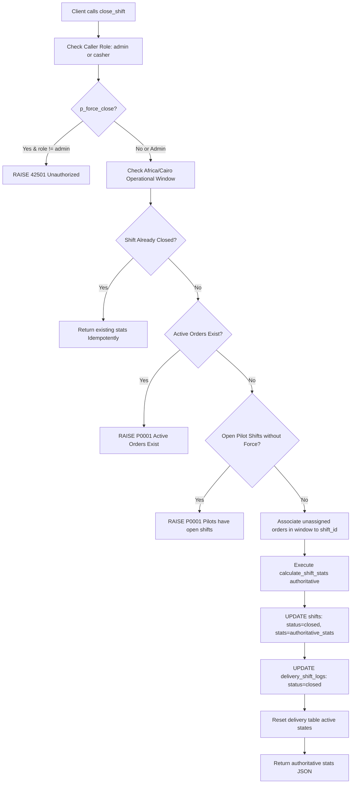

# Phase 6 Report: Authoritative Server-Side Financials & Shift Closure Engine

## 1. Executive Summary & Problem Analysis

### 1.1 The Vulnerability
Previously, critical financial calculations (gross sales, cash totals, electronic payments, delivery fees, and pilot earnings/attendance dues) were calculated on the client side inside the React application (`AppContext.jsx` / `activeStats`). When closing a shift, the frontend bundled these client-computed values into `p_stats` and sent them to the database RPC `close_shift(p_shift_id, p_stats)`.

This created a major security and financial integrity loophole:
- **Client Financial Authority**: A compromised client or network interception could submit arbitrary `p_stats` (e.g. reducing recorded cash or pilot dues).
- **Inconsistent Calculation Rules**: Client-side aggregations suffered from race conditions with live orders, missed unassigned orders, and relied on in-memory state.
- **Multiple Implementation Variants**: Several overlapping migration files existed for `close_shift` without clear status mapping.

### 1.2 Phase 6 Objectives
1. **Single Source of Truth**: Establish PostgreSQL as the authoritative engine for all financial metrics.
2. **Ignore Client Financial Data**: Redesign `close_shift` to completely discard client-provided `p_stats` and independently calculate financial totals directly from database records (`orders`, `delivery`, `delivery_shift_logs`, `reservations`).
3. **Classify Implementation Variants**: Audit and classify all legacy/active implementations without deleting migration history.
4. **End-to-End Verification**: Validate calculations, tamper resistance, idempotency, role security, and production builds across `AbuKhater_delivery` and `AbuKhater_Menu`.

---

## 2. Classification of Shift Closure Implementations

An audit of all `close_shift` definitions in the repository yielded the following status matrix:

| File / Implementation | Signature | Role & Status | Notes |
| :--- | :--- | :--- | :--- |
| `supabase/close_shift_rpc.sql` | `close_shift(uuid, jsonb)` | **LEGACY** | Original 2-parameter implementation. Accepted client `p_stats` without server calculation. |
| `supabase/fix_close_shift_orphan_orders.sql` | `close_shift(uuid, jsonb)` | **LEGACY** | Hotfix adding orphan order association; still relied on client `p_stats`. |
| `supabase/shift_governance.sql` | `close_shift(text, jsonb, boolean)` | **LEGACY** | Added Cairo timezone operational window and `p_force_close` parameter. |
| `supabase/server_enforced_authorization.sql` | `close_shift(text, jsonb, boolean)` | **LEGACY** | Added role checks (`admin`, `casher`); still trusted `p_stats`. |
| `supabase/migrations/20261001_phase6_authoritative_financials.sql` | `calculate_shift_stats(text)` `close_shift(text, jsonb, boolean)` | **ACTIVE** | **Official Authoritative Implementation**. Ignores client `p_stats`, enforces server-side calculations, role checks, Cairo operational window, and idempotent closure. |

---

## 3. Server-Side Financial Architecture

### 3.1 `calculate_shift_stats(p_shift_id text)`
Created a dedicated `SECURITY DEFINER` function with `search_path = public, pg_temp` that computes:

1. **Order Sales & Payment Breakdown**:
   - **Completed Gross Sales**: Sum of `total_amount` for orders with status `completed` or `delivered`.
   - **Cash Total**: Orders paid with cash (`payment_method ILIKE '%cash%'` excluding Vodafone/wallets).
   - **Electronic Total**: Orders paid via Vodafone Cash, InstaPay, Online Card, or Mobile Wallets.
   - **Delivery Fees & Service Fees**: Authoritative sums from completed orders.
2. **Pilot Earnings & Dues**:
   - **Trip Share (100%)**: For private trips (`order_type = 'trip'` or `source = 'external'`), the driver receives 100% of the `delivery_fee`.
   - **Regular Order Share (50%)**: For standard delivery orders (`manual`, `online`, `talabat`), the driver receives 50% of the `delivery_fee`.
   - **Failed Orders (0%)**: Failed deliveries (`failed_delivery`) earn 0 EGP pilot fee.
   - **Attendance Pay**: `floor(min(total_minutes, 600) / 35) * 15 EGP` (capped strictly at 10 hours / 600 minutes per shift). Scoped to the shift's operational window or `delivery_shift_logs`.
3. **Reservation Deposits**:
   - Aggregates confirmed reservation deposits (`status = 'confirmed'`) for the shift date/window.
4. **Net Cash in Drawer**:
   - Formula: `(Cash Sales + Reservation Deposits) - Total Pilot Dues`.

### 3.2 `close_shift(p_shift_id text, p_stats jsonb, p_force_close boolean)`
Redesigned the shift closure workflow:

---

## 4. Frontend Integration

### 4.1 `src/services/supabaseService.js`
- **`saveShiftReport(reportData, isForceClose)`**:
  - Dispatches `close_shift` with `p_stats: null` to guarantee zero reliance on client numbers.
  - Returns server-calculated stats.
- **`fetchShiftReports()`**:
  - Fetches closed shift history directly from `shifts` table, mapping authoritative `stats` jsonb to the client report model.
- **`getShiftStats(shiftId)`**:
  - Exposes live authoritative calculations via `calculate_shift_stats` RPC.

### 4.2 `src/context/AppContext.jsx`
- Loads historical `dailyReports` from `fetchShiftReports()` on application mount.
- `closeShift` calls `saveShiftReport` and synchronizes local state with authoritative server data returned by PostgreSQL.

---

## 5. Automated Verification & Test Results

Executed automated test suite (`scratch/test_phase6_financials.mjs`) on linked Supabase instance `htpnxizfqmnnkhemvmdz`:

| # | Test Scenario | Description | Result |
| :- | :--- | :--- | :--- |
| 1 | **Authoritative Calculations** | Verified Gross Sales (650 EGP), Cash (300 EGP), Electronic (350 EGP), Regular 50% vs Trip 100% vs Failed 0% delivery fee share (85 EGP), Attendance pay for 140 min (60 EGP), and total dues (145 EGP). | **PASSED** ✅ |
| 2 | **Active Orders Validation** | Verified that open/active orders strictly block shift closure. | **PASSED** ✅ |
| 3 | **Tamper Resistance / Authority** | Client passed fake totals (`grossSales: 10 EGP`, `pilotDues: 0 EGP`). Verified server completely ignored fake payload and persisted genuine 650 EGP & 145 EGP. | **PASSED** ✅ |
| 4 | **Idempotency** | Verified that repeated calls to `close_shift` on an already closed shift succeed without error and return existing stats. | **PASSED** ✅ |
| 5 | **Security & Role Restrictions** | Verified that cashier role cannot execute `p_force_close = true`. | **PASSED** ✅ |

**Summary**: **5 PASSED, 0 FAILED**.

---

## 6. Build Verification

- `AbuKhater_delivery`: Built successfully (`vite build`) with 0 errors.
- `AbuKhater_Menu`: Built successfully (`vite build`) with 0 errors.
