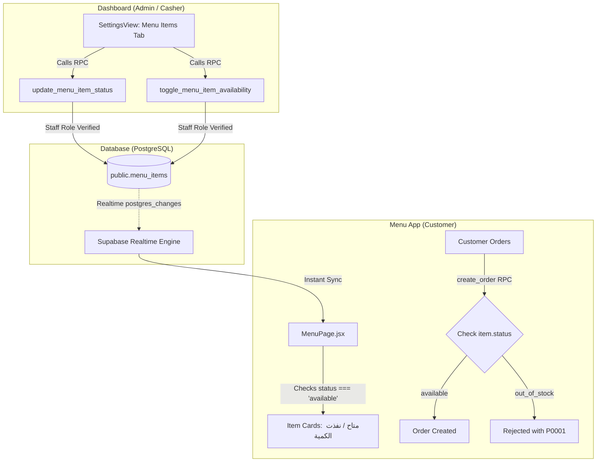

# Phase 7 Report: Menu Availability Source of Truth & Telegram Notification Security

## 1. Executive Summary & Problem Analysis

### 1.1 Part A: Menu Availability Dilemma
During the architecture discovery, an inconsistency was identified in how item availability was tracked:
- **`menu_availability` Table**: An empty table with zero rows was referenced in client code (`supabaseService.fetchMenuAvailability` / `updateMenuAvailability`). It represented an abandoned legacy concept that could fail silently or poison offline mutation queues.
- **`menu_items.status` Column**: The active production catalog of 174 items lived in `public.menu_items` with status strings (`available`, `out_of_stock`, `paused`, `hidden`).
- **`AbuKhater_Menu` Flow**: The customer menu application reads `menu_items` directly via `menuService.js`, checks `item.status === 'available'`, and listens to Realtime Postgres Changes on `menu_items`.
- **`create_order` Enforcement**: The server-side authoritative `create_order` RPC already inspects `menu_items.status` and rejects unavailable/out-of-stock items.
- **Missing Dashboard Interface**: Dashboard lacked a dedicated management interface to view items, filter by category, and toggle item availability live.

### 1.2 Part B: Telegram Notification & Webhook Security
- **Public Execute Vulnerability**: The `SECURITY DEFINER` function `public.send_telegram_message(text, text)` had `EXECUTE` permission granted to `PUBLIC`, `anon`, and `authenticated`. Any anonymous internet actor could call `/rest/v1/rpc/send_telegram_message` to send arbitrary messages/photos through the restaurant's Telegram bot.
- **Unused Edge Function Template**: The directory `supabase/functions/telegram-order-alert` contained a default boilerplate template returning `"Hello"` that was never deployed or wired.
- **Notification Resiliency**: Telegram triggers on `orders`, `reservations`, and `feedback` needed strict error-swallowing so that order creation and customer flows are never aborted if Telegram API is unreachable or if bot credentials are being rotated.

---

## 2. Source of Truth & Technical Decisions

### 2.1 Single Canonical Source of Truth for Menu Availability
| Entity | Classification | Status & Role |
| :--- | :--- | :--- |
| `public.menu_items.status` | **ACTIVE (Canonical Source of Truth)** | Controls item availability across Menu, Dashboard, and server-side RPCs. Allowed statuses: `available`, `out_of_stock`, `paused`, `hidden`. |
| `public.menu_availability` | **LEGACY / DEPRECATED** | Abandoned table with 0 rows. Client service methods now map transparently to `menu_items.status` for backwards compatibility. |

---

## 3. Database & Security Architecture Changes

### 3.1 Migration: `20261001_phase7_menu_availability_and_telegram_security.sql`

1. **RLS Policies Hardened on `menu_items` & `categories`**:
   - Dropped permissive legacy policies (`anon update menu_items`, `Allow public update menu`, `Allow public insert menu`, `anon update categories`).
   - `menu_items_select`: Public read (`anon`, `authenticated`) `USING (true)`.
   - `menu_items_staff_all`: Staff write (`authenticated`) `USING (public.has_role('admin') OR public.has_role('casher')) WITH CHECK (public.has_role('admin') OR public.has_role('casher'))`.
   - `categories_select`: Public read (`anon`, `authenticated`) `USING (true)`.
   - `categories_staff_all`: Staff write (`authenticated`) `USING (public.has_role('admin') OR public.has_role('casher')) WITH CHECK (public.has_role('admin') OR public.has_role('casher'))`.

2. **Authoritative Server RPCs**:
   - `update_menu_item_status(p_item_id uuid, p_status text)`: Role-guarded (`admin`, `casher`), normalizes status, updates `menu_items`.
   - `toggle_menu_item_availability(p_item_id uuid, p_is_available boolean)`: Role-guarded, toggles between `'available'` and `'out_of_stock'`.
   - `get_menu_items_admin()`: Returns full menu items with category information for the Dashboard.

3. **Telegram Notification Security Hardening**:
   - **Revoked Public Execute**: `REVOKE EXECUTE ON FUNCTION public.send_telegram_message(text, text) FROM PUBLIC, anon, authenticated;`
   - **Internal Execution Only**: `GRANT EXECUTE ON FUNCTION public.send_telegram_message(text, text) TO service_role, postgres;`
   - Hardened `search_path = public, pg_temp` on `send_telegram_message`, `send_order_to_telegram_fn`, `send_reservation_to_telegram_fn`, `send_feedback_to_telegram_fn`, and `_escape_telegram_markdown`.
   - Wrapped HTTP dispatch in exception handlers to guarantee zero customer flow disruption during bot token rotation or Telegram downtime.

---

## 4. Frontend Implementation

### 4.1 `AbuKhater_delivery` (Dashboard)
1. **[`src/services/supabaseService.js`](file:///c:/Users/mamdo/Documents/GitHub/AbuKhater_delivery/src/services/supabaseService.js)**:
   - Added `fetchMenuItemsAdmin()` to load menu items directly from `get_menu_items_admin` RPC.
   - Added `updateMenuItemStatus(itemId, status)` to dispatch `update_menu_item_status`.
   - Added `toggleMenuItemAvailability(itemId, isAvailable)` to dispatch `toggle_menu_item_availability`.
   - Refactored legacy `fetchMenuAvailability` and `updateMenuAvailability` to read/write `menu_items` transparently.
2. **[`src/components/settings/SettingsView.jsx`](file:///c:/Users/mamdo/Documents/GitHub/AbuKhater_delivery/src/components/settings/SettingsView.jsx)**:
   - Added sub-tab switcher: "⚙️ إعدادات النظام والأسعار والتوصيل" vs "🍔 إدارة إتاحة أصناف المنيو".
   - Search bar by item name or description.
   - Category filter dropdown and status filter pills (الكل, متاح, نفذت الكمية, موقوف).
   - Real-time availability toggle switch with instant optimistic updates and toast feedback.
   - Detailed status selector (`available`, `out_of_stock`, `paused`, `hidden`).

### 4.2 `AbuKhater_Menu` (Customer App)
- Already integrated with `menu_items` and subscribes to `postgres_changes` on `menu_items` table.
- When an Admin disables an item in Dashboard, `AbuKhater_Menu` automatically receives the event, re-renders the item as "غير متاح" / "نفذت الكمية", and disables adding to cart.

---

## 5. Automated Verification & Test Results

Executed automated test suite (`scratch/test_phase7_menu_and_telegram.mjs`) on linked Supabase instance `htpnxizfqmnnkhemvmdz`:

| # | Test Scenario | Description | Result |
| :- | :--- | :--- | :--- |
| 1 | **Admin Disables Item** | Admin changes item status to `out_of_stock` via `update_menu_item_status` RPC. Verified `menu_items` record status updated. | **PASSED** ✅ |
| 2 | **Order Rejection on Disabled Item** | Customer attempts `create_order` containing the `out_of_stock` item. Server strictly rejected with `P0001: الصنف ... غير متوفر حالياً`. | **PASSED** ✅ |
| 3 | **Admin Re-Enables Item** | Admin toggles item back to `available` via `toggle_menu_item_availability`. Customer places order; verified order created successfully with correct total. | **PASSED** ✅ |
| 4 | **Authorization Enforcement** | Anonymous caller attempts to invoke `update_menu_item_status`. Server blocked execution with `42501 Unauthorized`. | **PASSED** ✅ |
| 5 | **Telegram Security Revocation** | Anonymous caller attempts direct execution of `send_telegram_message`. Server blocked execution with `42501 Permission Denied`. | **PASSED** ✅ |

**Summary**: **5 PASSED, 0 FAILED**.

---

## 6. Build Verification

- `AbuKhater_delivery`: Built successfully (`vite build`) with 0 errors.
- `AbuKhater_Menu`: Built successfully (`vite build`) with 0 errors.

---

## 7. Remaining Risks & Rollback Notes

- **Bot Token Rotation**: `TELEGRAM_BOT_TOKEN` in `app_config` currently holds a placeholder value. When deploying live credentials, update `app_config` via Admin SQL/Vault.
- **Rollback**: If rollback is needed, restore previous policies and functions using migration scripts; existing `menu_items` data remains completely intact.
