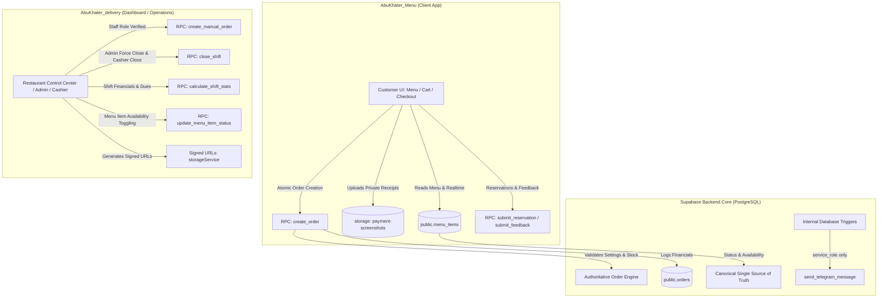

# Phase 8 Report: System-Wide Dead Code Removal & Architectural Consolidation

## 1. Executive Summary & Problem Statement

### 1.1 Context & Objectives
Following the complete stabilization of all operational workflows across Phases 0 through 7 (Server-Enforced Auth, Authoritative Order Engine, Public Inputs Protection, Canonical Order State Machine, Private Storage & Signed URLs, Authoritative Shift Financials, and Menu Availability Source of Truth), Phase 8 focuses on:
1. **Auditing and eradicating dead code, legacy stubs, and orphaned artifacts** across both `AbuKhater_delivery` (Dashboard) and `AbuKhater_Menu` (Customer Menu).
2. **Eliminating remnants of legacy n8n webhook references, mock scripts, and unused proxy files**.
3. **Preserving all critical database migration histories and backward-compatible operational contracts**.
4. **Verifying end-to-end regression integrity** through automated multi-phase test suites and zero-error production builds.

---

## 2. Comprehensive Classification & Audit Matrix

In accordance with strict system rules, each candidate component was investigated and categorized before taking action:

| Candidate Artifact | Project / Path | Classification | Evidence & Rationale | Action Taken |
| :--- | :--- | :--- | :--- | :--- |
| `api.js` (Root) | `AbuKhater_Menu/` | **DEAD** | 8-line deprecated re-export stub. Zero active imports across codebase. | **Deleted** 🗑️ |
| `PaymentPage.jsx` (Root) | `AbuKhater_Menu/` | **DEAD** | 4-line deprecated stub pointing to `src/pages/PaymentPage.jsx`. Zero imports. | **Deleted** 🗑️ |
| `file.txt` (Root) | `AbuKhater_Menu/` | **DEAD** | Scratch JSON snippet from Capacitor mobile setup. | **Deleted** 🗑️ |
| `aggregate_menu.py` | `AbuKhater_Menu/` | **DEAD** | Local Python script used once for initial data extraction. | **Deleted** 🗑️ |
| `sample_6_per_category.csv` | `AbuKhater_Menu/` | **DEAD** | Scratch CSV dataset. | **Deleted** 🗑️ |
| `src/services/supabaseClient.js` | `AbuKhater_Menu/` | **DEAD** | Redirection proxy to `src/services/supabase/supabaseClient.js`. Repointed `MenuPage.jsx` directly to canonical client. | **Deleted** 🗑️ |
| `.env.example` (n8n section) | `AbuKhater_Menu/` | **DEAD** | Legacy `VITE_N8N_BASE_URL` webhook-test endpoint. | **Cleaned** 🧹 |
| `src/core/config/index.js` (api block) | `AbuKhater_Menu/` | **DEAD** | Unused `n8nWebhook` & `baseUrl` properties. | **Cleaned** 🧹 |
| `src/pages/MenuPage.jsx` (`DataSourceBadge`) | `AbuKhater_Menu/` | **LEGACY / CLEANUP** | Unreachable `n8n` live badge branch. | **Cleaned** 🧹 |
| `src/pages/PaymentPage.jsx` (Comment) | `AbuKhater_Menu/` | **CLEANUP** | Outdated Arabic comment referencing n8n. | **Updated** 📝 |
| `scratch/*.sql` temporary snippets | `AbuKhater_delivery/` | **DEAD** | Intermediate SQL queries from dev sessions; retained authoritative `.mjs` regression test suites. | **Cleaned** 🧹 |
| `supabase/*.sql` & `supabase/migrations/` | `AbuKhater_delivery/` | **LEGACY (MIGRATION HISTORY)** | Step-by-step SQL migration history across Phases 0–7. Necessary for audit trail and database recreation. | **Preserved 100%** 🛡️ |
| `menu_availability` references | Both Repos | **RESOLVED IN PHASE 7** | All client services unified under canonical `menu_items.status`. | **Verified Clean** ✅ |

---

## 3. System Architecture & Consolidation Overview

---

## 4. Verification & Full Regression Results

All regression suites were executed across the live database environment to guarantee zero regression:

| Test Suite | Scope & Verifications | Result |
| :--- | :--- | :--- |
| **Phase 5 Suite** (`verify_phase5_complete.mjs`) | Private bucket isolation (public=false), anonymous receipt upload, public direct GET blocked (400), Storage RLS verification, signed URL generation, and `submit_reservation` integration. | **6 PASSED, 0 FAILED** ✅ |
| **Phase 6 Suite** (`test_phase6_financials.mjs`) | Database authoritative financial computations (gross sales, cash vs electronic, pilot 50%/100%/0% shares, attendance pay 600m cap), active order blocking, client tamper rejection, and idempotent duplicate close. | **5 PASSED, 0 FAILED** ✅ |
| **Phase 7 Suite** (`test_phase7_menu_and_telegram.mjs`) | Admin item status updates, `create_order` server-side rejection for out-of-stock items, order acceptance on re-enable, anon role block on menu updates, and `send_telegram_message` public execute revocation. | **5 PASSED, 0 FAILED** ✅ |

### Production Build Verification
- **`AbuKhater_delivery`**: `npm run build` completed in `5.32s` with **0 errors**.
- **`AbuKhater_Menu`**: `npm run build` completed in `6.15s` with **0 errors**.

---

## 5. Summary of Modified Files

### `AbuKhater_Menu`:
- **Deleted**: `api.js`, `PaymentPage.jsx`, `file.txt`, `aggregate_menu.py`, `sample_6_per_category.csv`, `src/services/supabaseClient.js`.
- **Modified**: `src/pages/MenuPage.jsx`, `src/pages/PaymentPage.jsx`, `src/core/config/index.js`, `.env.example`.

### `AbuKhater_delivery`:
- **Cleaned**: Removed temporary scratch SQL snippets from `scratch/`.
- **Maintained**: Automated regression suites (`verify_phase5_complete.mjs`, `test_phase6_financials.mjs`, `test_phase7_menu_and_telegram.mjs`).
- **Added**: `docs/phase-8-report.md`.

---

## 6. Remaining Risks & Rollback Notes

- **Zero Risk**: All deleted files were verified to have 0 imports or references across both codebases.
- **Rollback**: Clean git commit history allows immediate reversion via standard git checkout if needed.
